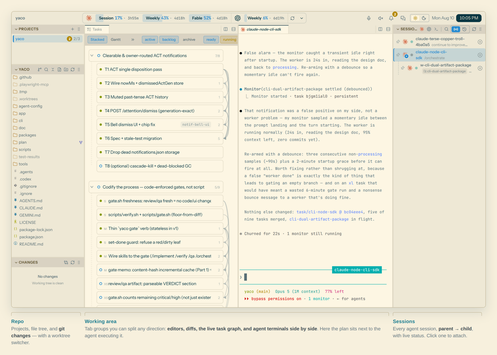
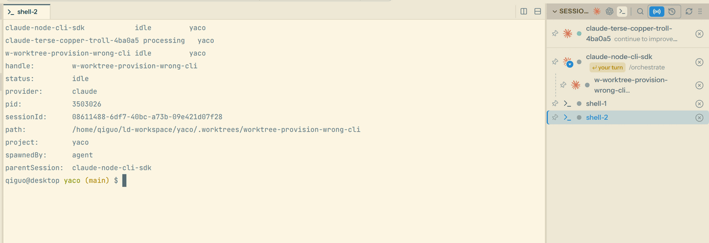
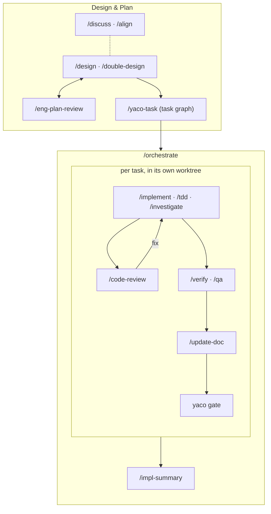
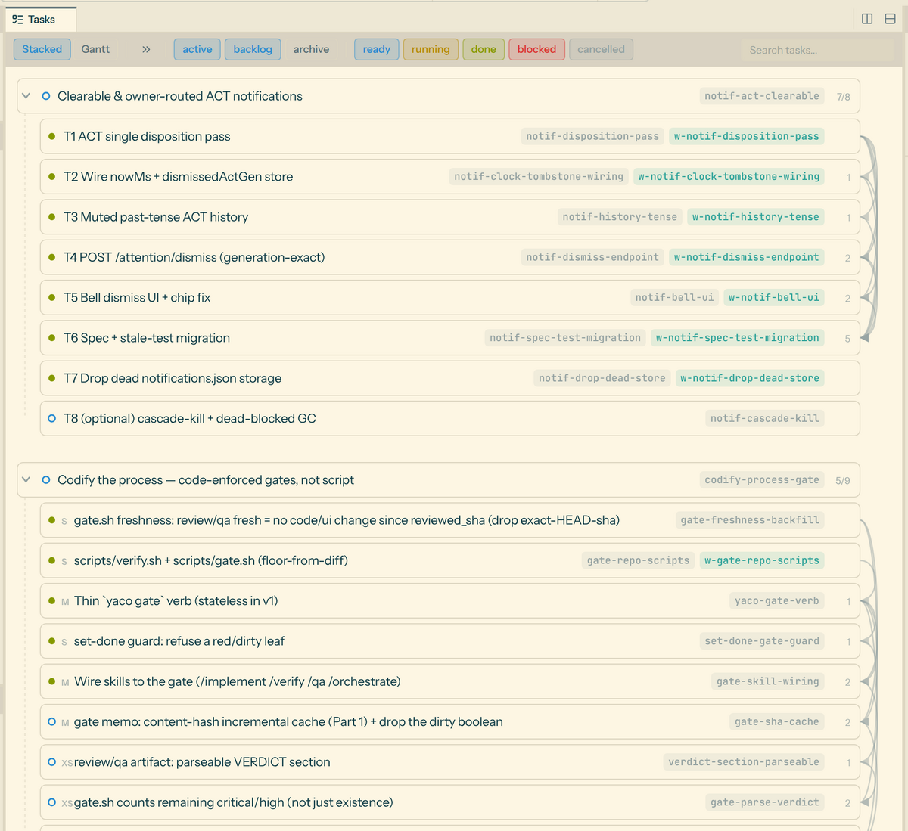
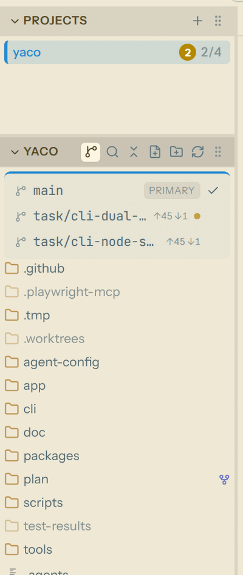
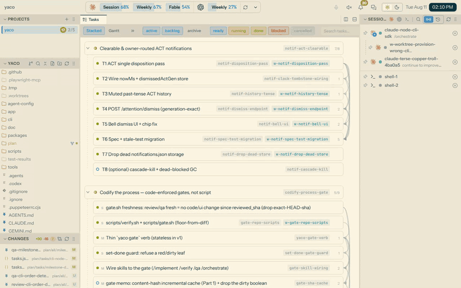
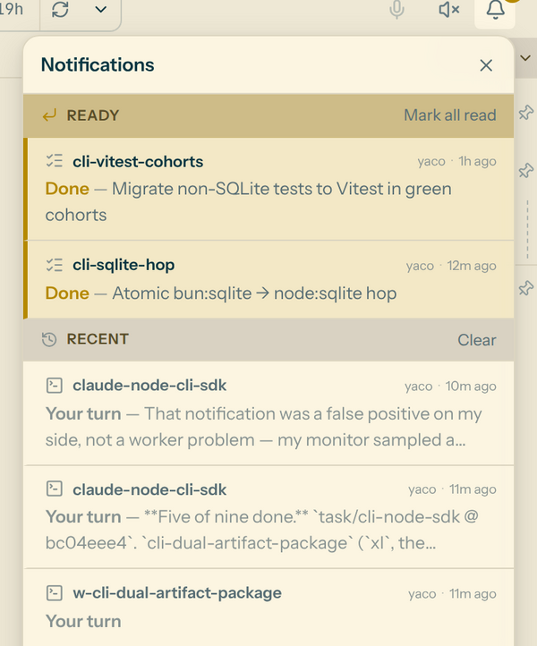
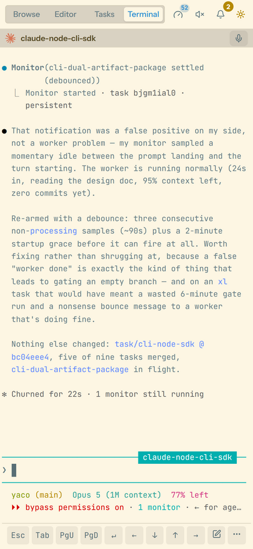

<div align="center">

# YACO

**Y**et **A**nother **C**oder **O**rchestrator — or, on days when the
collaboration is going well, the **Y**ou–**A**gent **C**ollaboration
**O**rchestrator.

**A local-first workspace for running coding agents on your own machine:
one CLI to orchestrate them, a skill library that encodes how you work,
and a browser IDE to watch it all happen — from any device you own.**

[](LICENSE)
[](https://nodejs.org)
[](#prerequisites)

[Quickstart](#quickstart) · [The agent CLI](#layer-1--the-agent-cli) ·
[Skills & workflow](#layer-2--skills-and-the-workflow) · [The app](#layer-3--the-app) ·
[Docs](doc/main/README.md)

</div>

<p align="center">
  <picture>
    <source media="(prefers-color-scheme: dark)" srcset="doc/assets/hero-dark.png">
    
  </picture>
</p>

YACO is an **orchestration layer, not an agent** — it never talks to a model.
It starts, tracks, and attaches to the agent CLIs you already have:
[Claude Code](https://claude.com/claude-code) and
[Codex](https://developers.openai.com/codex/cli) today, built to extend to any
terminal coding agent. One rule shapes the whole design: **agents orchestrate
other agents through the exact same commands you use.** You have direct
observability into every session your agents spawn — and they into yours.

## Three layers

| Layer | What it gives you | Depends on |
|---|---|---|
| **1 · Agent CLI** | `yaco agent` — start, message, watch, and kill agent sessions. tmux-backed, so sessions outlive your terminal, your browser, and the server. This is the multi-agent primitive. | nothing — works standalone |
| **2 · Skills & workflow** | 22 workflow skills (`/design`, `/implement`, `/orchestrate`, …) plus the CLI built for them: per-repo task graphs, git-worktree isolation, plans and gates. This layer is *how you work* — opinionated, personal, rapidly evolving. | layer 1 |
| **3 · The app** | A web server + browser IDE: editor, file tree, diffs, search, terminals, voice input, agent/task notifications, and the parent→child agent session tree. Use it on this machine, from another one, or from your phone — over Tailscale or however you connect. | layers 1 & 2 |

## Quickstart

### Prerequisites

Linux or macOS, with:

- **[Claude Code](https://claude.com/claude-code) (`claude`) or
  [Codex](https://developers.openai.com/codex/cli) (`codex`) on your `PATH`** —
  one is enough. YACO ships no agent; you can install one later, but no
  session can run without it.
- **Node.js ≥ 24.15 + npm**, **tmux**, **git**.
- Linux only: `make`, `python3`, and a C/C++ compiler
  (`sudo apt install make python3 build-essential`) — `node-pty` compiles from
  source.

### Install

Two ways to install — pick one.

**From npm**, to use YACO — the CLI ships all 22 skills:

```bash
npm install -g yaco-cli yaco-app
yaco install
```

**From a clone**, to change it — skills included:

```bash
git clone https://github.com/imoonkey/yaco.git && cd yaco
tools/install.sh
```

Re-run the install step after upgrading, pulling, or editing a skill.

### First session

```bash
cd <any-repo>
yaco claude "give me a tour of this repo"
```

That's it — a tmux-backed session that outlives your terminal, managed with
`yaco agent list` / `capture` / `send` / `kill`.

For the browser IDE, run `yaco-app` (from a clone: `npm run start:app`), open
<http://localhost:3001>, and add your repo as a project — the session you just
started is already there as a terminal tab.

## Layer 1 — the agent CLI

```bash
yaco claude "fix the flaky test" [--name <handle>] [--wait]  # or: yaco codex …
yaco agent list [--all]               # sessions here — or everywhere
yaco agent capture <handle>           # recent output
yaco agent send <handle> "…" [--wait] # reply — --wait blocks for the response
yaco agent kill <handle>              # end it
```

And that is precisely how multi-agent works here: your agents run these same
commands to spawn and coordinate sub-agents, so every session an agent creates
is one you can list, capture, and attach to. No hidden recursion, no
privileged internal API.

<picture>
  <source media="(prefers-color-scheme: dark)" srcset="doc/assets/agent-tree-dark.png">
  
</picture>

The same sessions, from the CLI and from the app — here an orchestrator and
the worker it started in its own worktree.

## Layer 2 — skills and the workflow

Twenty-two skills in
[`agent-config/global/skills/`](agent-config/global/skills/) encode the
development loop — and drive the `yaco` subcommands built for it: `yaco task`
(a per-repo task graph under `plan/`), `yaco worktree` (one task, one
checkout), `yaco plan`, `yaco gate`. They install alongside — never
replacing — the skills you already have.

A milestone typically flows like this — drawn linear, lived with loops:



Always on, in any phase: `/coding-standards`, `/simplify-code-arch`,
`/ultra-think`, `/yaco-paths`. Onboarding: `/init-all` sets a repo up for
multi-agent work. And "design" here means *engineering* design — what comes
before it (scoping, product design, UX specs) is deliberately bring-your-own:
drop your own skills into `~/.claude/skills` and they slot straight into the
same loop.

<table>
<tr>
<td width="62%"><picture><source media="(prefers-color-scheme: dark)" srcset="doc/assets/tasks-dark.png"></picture></td>
<td width="38%"><picture><source media="(prefers-color-scheme: dark)" srcset="doc/assets/worktrees-dark.png"></picture></td>
</tr>
<tr>
<td><b>The task graph is a file</b>, and the app renders it — states, worksets,
real <code>depends</code> edges, and a Gantt view when you want dates.</td>
<td><b>One task, one worktree.</b> Switch the whole workspace between
<code>main</code> and any <code>task/&lt;slug&gt;</code> checkout.</td>
</tr>
</table>

The workflow's paper trail — the task graph, design docs, reviews, QA and
implementation summaries — lives in `<repo>/plan/`, next to the code and
committed with it by default; a visible design history is a feature. The
design docs and task graph are the parts you co-author; the rest the agents
write and you mostly read — implementation summaries routinely, the others
when you need them. If you'd rather
not commit it with the code, `yaco plan init` promotes `plan/` into a
separate, colocated git repo the host repo ignores; every file stays exactly
where it was ([doc/main/cli/plan.md](doc/main/cli/plan.md)).

This layer is the least settled, on purpose: nobody — us included — knows the
right way to work with coding agents yet. Treat these skills as a fork-and-edit
starting point, not a doctrine.

## Layer 3 — the app

`yaco-app` — or `npm run start:app` from a clone — then open
<http://localhost:3001>. Single user, file-based state, no database. It is
deliberately a *simple* IDE — editor, file explorer, cross-file search, git
and diff views, terminals — plus the parts a traditional IDE doesn't have:

- **Sessions that outlive the browser.** Every terminal is a tmux session:
  close the tab, restart the server, reattach later — from the app or a plain
  terminal.
- **The agent tree — and it tells you when it's your turn.** Parent and child
  sessions rendered as the tree they are; an agent finishing or waiting on
  your reply is pushed to the notification bell, the session's badge, and
  your browser's notifications. It can even read them aloud.
- **The whole workspace on your phone.** Over Tailscale or however you
  connect: touch layout, a terminal key bar, voice input. Kick off a task
  from anywhere and get the notification when it's done.
- **Voice input built for prompting.** Record, transcribe, auto-format the
  rambling into clean prose, review — then insert into the editor or paste
  straight into an agent's terminal.
- **Plans and design docs, first-class.** The task graph under `plan/`
  rendered live, and markdown editing built for the `/design` and `/discuss`
  review loops — plus opt-in inline suggestions for prose.

<picture>
  <source media="(prefers-color-scheme: dark)" srcset="doc/assets/walkthrough-dark.gif">
  
</picture>

<table>
<tr>
<td width="58%"><picture><source media="(prefers-color-scheme: dark)" srcset="doc/assets/notifications-dark.png"></picture></td>
<td width="42%"><picture><source media="(prefers-color-scheme: dark)" srcset="doc/assets/mobile-dark.png"></picture></td>
</tr>
<tr>
<td>The notification panel: finished tasks, and sessions waiting on a
reply — each one routes to the session that needs you.</td>
<td>The same agent session, phone-sized — terminal key bar and voice input
included.</td>
</tr>
</table>

More screenshots: [doc/main/app/tour.md](doc/main/app/tour.md).

Everything above runs with zero configuration, except the AI text helpers:
voice transcription needs a signed-in Codex CLI or a `GROQ_API_KEY`;
transcript auto-formatting and inline suggestions need the `GROQ_API_KEY`.
Set it in the server's environment (or `.env`).

## Customizing

YACO started life as a personal tool, and the layers are honestly coupled — the
app assumes the CLI and skills exist. So the best way to change any layer is
the intended way: **tell your agent what you want.** The whole stack is plain
TypeScript orchestrating tools your agent already understands, and it is built
and maintained exactly this way.

## Repository layout

| Path | Contents |
|---|---|
| `cli/` | The `yaco` CLI: `agent`, `task`, `worktree`, `plan`, `project`, `install`, `doctor`, `gate`, … |
| `agent-config/` | The workflow skills installed for Claude Code and Codex |
| `app/server/` | Hono backend: file/git/task APIs, WebSocket terminals, SSE watchers |
| `app/ui/` | React + Vite frontend |
| `packages/` | Shared libraries used by the app |
| `tools/` | The bootstrap installer |
| `doc/` | Documentation |

## Development

```bash
bash scripts/verify.sh
```

runs the standard gate — CLI, server, and UI checks, stopping at the first
failure. What it covers and deliberately skips is in
[doc/dev/README.md](doc/dev/README.md). Commits follow
[Conventional Commits](https://www.conventionalcommits.org/).

## Documentation

- [doc/main/README.md](doc/main/README.md) — architecture and subsystem docs.
- [doc/dev/README.md](doc/dev/README.md) — development workflows.
- [doc/PROGRESS.md](doc/PROGRESS.md) — change history.

## License

MIT — see [LICENSE](LICENSE).
