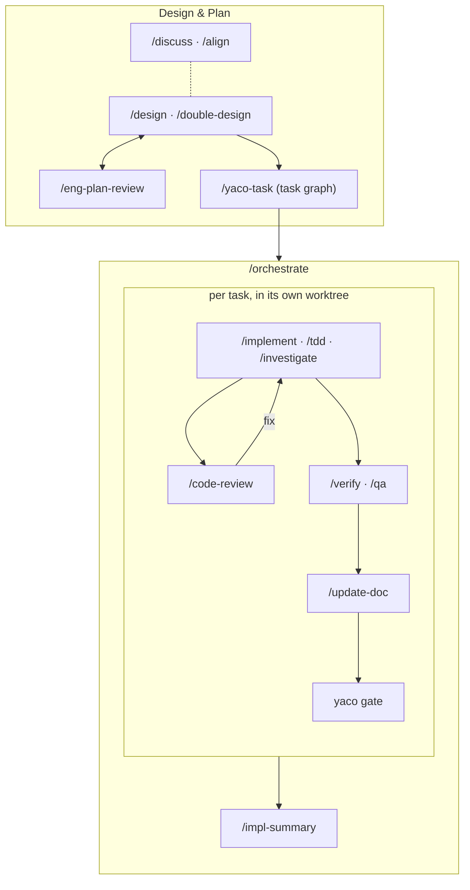

<div align="center">

# YACO

**Y**et **A**nother **C**oder **O**rchestrator — or, on days when the
collaboration is going well, the **Y**ou–**A**gent **C**ollaboration
**O**rchestrator.

**A local-first workspace for running coding agents on your own machine:
one CLI to orchestrate them, a skill library that encodes how you work,
and a browser IDE to watch it all happen — from any device you own.**

[](LICENSE)
[](https://nodejs.org)
[](#prerequisites)

[Quickstart](#quickstart) · [The agent CLI](#layer-1--the-agent-cli) ·
[Skills & workflow](#layer-2--skills-and-the-workflow) · [The app](#layer-3--the-app) ·
[Docs](doc/main/README.md)

</div>

<p align="center">
  <picture>
    <source media="(prefers-color-scheme: dark)" srcset="doc/assets/hero-dark.png">
    
  </picture>
</p>

YACO is an **orchestration layer, not an agent** — it never talks to a model.
It starts, tracks, and attaches to the agent CLIs you already have:
[Claude Code](https://claude.com/claude-code) and
[Codex](https://developers.openai.com/codex/cli) today, built to extend to any
terminal coding agent. One rule shapes the whole design: **agents orchestrate
other agents through the exact same commands you use.** You have direct
observability into every session your agents spawn — and they into yours.

## Three layers

| Layer | What it gives you | Depends on |
|---|---|---|
| **1 · Agent CLI** | `yaco agent` — start, message, watch, and kill agent sessions. tmux-backed, so sessions outlive your terminal, your browser, and the server. This is the multi-agent primitive. | nothing — works standalone |
| **2 · Skills & workflow** | 22 workflow skills (`/design`, `/implement`, `/orchestrate`, …) plus the CLI built for them: per-repo task graphs, git-worktree isolation, plans and gates. This layer is *how you work* — opinionated, personal, rapidly evolving. | layer 1 |
| **3 · The app** | A web server + browser IDE: editor, file tree, diffs, search, terminals, voice input, agent/task notifications, and the parent→child agent session tree. Use it on this machine, from another one, or from your phone — over Tailscale or however you connect. | layers 1 & 2 |

## Quickstart

### Prerequisites

Linux or macOS, with:

- **[Claude Code](https://claude.com/claude-code) (`claude`) or
  [Codex](https://developers.openai.com/codex/cli) (`codex`) on your `PATH`** —
  one is enough. YACO ships no agent, so this is the one prerequisite it cannot
  supply and the thing every agent command drives. You can install it after
  YACO: `yaco install` completes either way, and reports the gap rather than
  failing on it — `SKIP providers  no provider executable on $PATH (claude,
  codex) — install one before starting agents`. Until you close it, `yaco
  doctor` keeps printing that line and no agent session can run.
- **Node.js ≥ 24.15 + npm**, **tmux**, **git**. The CLI declares that floor in
  `engines.node` and its launcher rejects anything below it — `node:sqlite` is
  silent from 24.15 and warns on stderr before it, and empty stderr is an
  asserted contract.
- Linux only: `make`, `python3`, and a C/C++ compiler — `node-pty`, which backs
  every terminal, compiles from source on Linux
  (`sudo apt install make python3 build-essential`).

### Install

**From npm — no clone.** The CLI carries the 22 skills inside it, so this is a
complete layers 1 + 2 install:

```bash
npm install -g yaco-cli
yaco install
```

`npm install -g` is inert: it puts files and the `yaco` executable on disk and
touches nothing else. `yaco install` is the separate, explicit step that
configures the machine — it merges provider hooks into `~/.claude` and
`~/.codex`, writes the agent wrapper, plants one symlink per skill into
`~/.claude/skills` (alongside — never replacing — the skills you already have),
and finishes with `yaco doctor`. Everything it plants comes out of the installed
package, so nothing points at a directory that could go away. Add
`npm install -g yaco-app` for layer 3. Re-run `yaco install` after either
upgrade.

Doctor reports what you have not set up yet — the project registry, the task
graph, an agent CLI — as **SKIP** rather than failing, so this install completes
on a machine that is only part of the way there. Register your own repos with
`yaco project add <name> <path>` when you have one; every line doctor skips
names what it is waiting for.

**From a clone — the way to change YACO.** The skills are the layer most people
will want to edit, and an installed package is a read-only copy of them, so
**modifying YACO's behaviour means cloning it**:

```bash
git clone https://github.com/imoonkey/yaco.git
cd yaco
tools/install.sh
```

This packs `yaco-cli` and installs that same tarball into
`${YACO_BIN_DIR:-~/.local/bin}`'s prefix (make sure the bin dir is on your
`PATH`), then runs `yaco install` for you and additionally npm-installs the app
and registers this repo as a project. Re-run it after `git pull` — and after
editing a skill, since what `yaco install` links to is the copy inside the built
package (`--cli-only` skips the app's npm installs). The steps are not
transactional: if one fails, the earlier ones already ran, so read the error and
re-run.

It installs the tarball rather than linking the checkout deliberately: what
lands on your `PATH` is byte-for-byte the artifact npm would deliver. A clone
that has never been installed bootstraps the CLI workspace's dependencies first
— a few seconds, no native compilation.

### First session

```bash
yaco-app                                     # 1. serve on http://localhost:3001
                                             #    from a clone: npm run start:app
yaco project add myrepo /abs/path/to/myrepo  # 2. register a repo (new terminal)
cd /abs/path/to/myrepo
yaco claude "give me a tour of this repo"    # 3. start an agent in it
```

That session is now both a handle in the CLI and a terminal tab in the app you
can type into directly.

## Layer 1 — the agent CLI

```bash
yaco claude "fix the flaky checkout test"   # or: yaco codex …
yaco agent list --all        # every session, across every project
yaco agent capture <handle>  # recent output
yaco agent send <handle> "…" # reply to it
yaco agent kill <handle>     # end it
```

Add `--wait` to block until the agent finishes and print its reply; arguments
after a bare `--` pass through to the provider CLI. And that is precisely how
multi-agent works here: your agents run these same commands to spawn and
coordinate sub-agents, so every session an agent creates is one you can list,
capture, and attach to. No hidden recursion, no privileged internal API.

<picture>
  <source media="(prefers-color-scheme: dark)" srcset="doc/assets/agent-tree-dark.png">
  
</picture>

The same sessions, from the CLI and from the app. `spawnedBy: agent` and
`parentSession` are all the lineage there is — here an orchestrator that started
a worker in its own worktree, and whatever that worker starts in turn.

## Layer 2 — skills and the workflow

Twenty-two skills in
[`agent-config/global/skills/`](agent-config/global/skills/) encode the
development loop — and drive the `yaco` subcommands built for it: `yaco task`
(a per-repo task graph under `plan/`), `yaco worktree` (each task gets its own
checkout at `.worktrees/<slug>` on branch `task/<slug>`), `yaco plan`,
`yaco gate`. They ship **inside `yaco-cli`**, and the installer plants them as
**per-skill symlinks** into `~/.claude/skills`, alongside — never replacing —
the skills you already have. From a clone, those links point at the copy in the
built package rather than at your working tree, so re-run `tools/install.sh`
after editing one.

A milestone typically flows like this — drawn linear, lived with loops:



Always on, in any phase: `/coding-standards`, `/simplify-code-arch`,
`/ultra-think`, `/yaco-paths`. Onboarding: `/init-all` sets a repo up for
multi-agent work. And "design" here means *engineering* design — what comes
before it (scoping, product design, UX specs) is deliberately bring-your-own:
drop your own skills into `~/.claude/skills` and they slot straight into the
same loop.

<table>
<tr>
<td width="62%"><picture><source media="(prefers-color-scheme: dark)" srcset="doc/assets/tasks-dark.png"></picture></td>
<td width="38%"><picture><source media="(prefers-color-scheme: dark)" srcset="doc/assets/worktrees-dark.png"></picture></td>
</tr>
<tr>
<td><b>The task graph is a file</b>, and the app renders it — states, worksets,
real <code>depends</code> edges, and a Gantt view when you want dates.</td>
<td><b>One task, one worktree.</b> Switch the whole workspace between
<code>main</code> and any <code>task/&lt;slug&gt;</code> checkout.</td>
</tr>
</table>

This layer is the least settled, on purpose: nobody — us included — knows the
right way to work with coding agents yet. Treat these skills as a fork-and-edit
starting point, not a doctrine.

## Layer 3 — the app

`yaco-app` — or `npm run start:app` from a clone — then open
<http://localhost:3001>. Single user, file-based state, no database. It is
deliberately a *simple* IDE — editor, file explorer, cross-file search, git and
diff views, terminals, voice input — plus the parts a traditional IDE doesn't
have:

- **Sessions that outlive the browser.** Every terminal is a tmux session:
  close the tab, restart the server, reattach later — from the app or a plain
  terminal.
- **The agent tree.** Parent and child agent sessions rendered as the tree they
  are, with notifications when a session or task needs you.
- **Skill-aware markdown.** Design docs are first-class, with editing built for
  the `/design` and `/discuss` review loops.
- **The task graph, live.** The plan under `plan/tasks/` rendered as a graph.

<picture>
  <source media="(prefers-color-scheme: dark)" srcset="doc/assets/walkthrough-dark.gif">
  
</picture>

<table>
<tr>
<td width="58%"><picture><source media="(prefers-color-scheme: dark)" srcset="doc/assets/notifications-dark.png"></picture></td>
<td width="42%"><picture><source media="(prefers-color-scheme: dark)" srcset="doc/assets/mobile-dark.png"></picture></td>
</tr>
<tr>
<td><b>It tells you when it's your turn.</b> Sessions and tasks raise their own
notifications, routed to the one that needs you.</td>
<td><b>And it's the same workspace on a phone</b> — terminal key bar, voice
input, everything.</td>
</tr>
</table>

More screenshots: [doc/main/app/tour.md](doc/main/app/tour.md).

## Customizing

YACO started life as a personal tool, and the layers are honestly coupled — the
app assumes the CLI and skills exist. So the best way to change any layer is
the intended way: **tell your agent what you want.** The whole stack is plain
TypeScript orchestrating tools your agent already understands, and it is built
and maintained exactly this way.

## Your `plan/` directory

YACO keeps each project's task graph and design docs in `<repo>/plan/`, next to
the code, committed with the rest of the repo by default — a visible design
history in a public repo is a feature. If yours shouldn't be public:

```bash
yaco plan init          # optionally: --remote <url>
```

This promotes `plan/` into a separate git repo colocated inside the working
tree and hides it from the host repo via `.git/info/exclude` — your editor,
`rg`, and YACO still see the files exactly where they were. It is idempotent
and must be re-run on every fresh clone. Two things it deliberately does not
do: it cannot untrack files the host repo already committed (run
`git rm -r --cached plan` yourself — and history keeps them until rewritten),
and `--remote` records an origin without pushing — creating and verifying a
private remote is on you. (YACO's own `plan/` is private because it holds a
personal corpus of agent interactions; that's the exception, not the
recommendation.) Paths are configurable in `yaco.toml` under `[paths]`;
`yaco paths project --json` reports what's in effect.

## Repository layout

| Path | Contents |
|---|---|
| `cli/` | The `yaco` CLI: `agent`, `task`, `worktree`, `plan`, `project`, `install`, `doctor`, `gate`, … |
| `agent-config/` | The workflow skills installed for Claude Code and Codex |
| `app/server/` | Hono backend: file/git/task APIs, WebSocket terminals, SSE watchers |
| `app/ui/` | React + Vite frontend |
| `packages/` | Shared libraries used by the app |
| `tools/` | The bootstrap installer |
| `doc/` | Documentation |

## Development

```bash
bash scripts/verify.sh
```

runs the standard gate — CLI tests, the `yaco-codex-transcribe` typecheck and
tests, server tests, UI lint and build — stopping at the first failure. The
suites it deliberately skips (UI component tests, Playwright e2e, CLI
integration) and their side effects are covered in
[doc/dev/README.md](doc/dev/README.md). Commits follow
[Conventional Commits](https://www.conventionalcommits.org/).

## Documentation

- [doc/main/README.md](doc/main/README.md) — architecture and subsystem docs.
- [doc/dev/README.md](doc/dev/README.md) — development workflows.
- [doc/PROGRESS.md](doc/PROGRESS.md) — change history.

## License

MIT — see [LICENSE](LICENSE).
