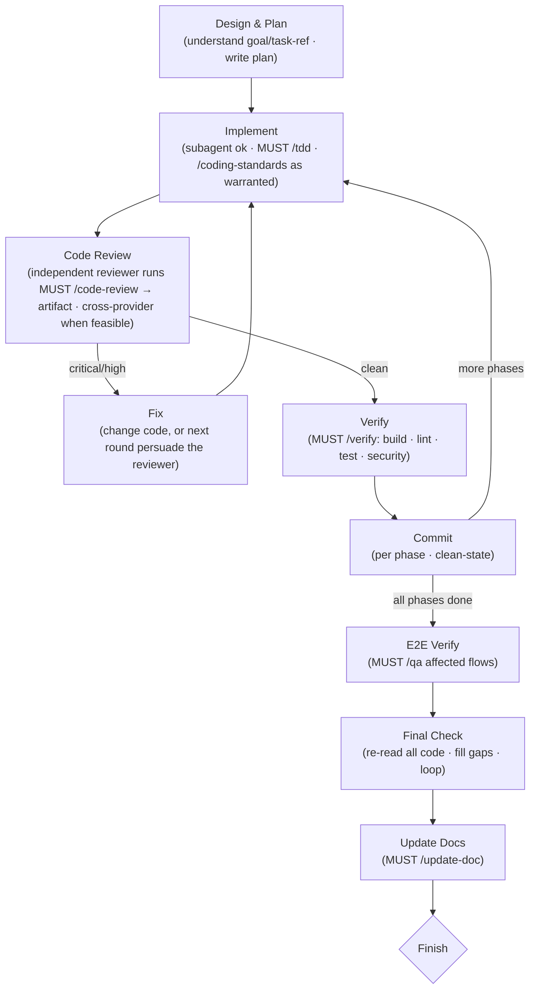

# Implement

Given a goal or task (system design, feature, refactor), drive it from plan to done.

`/implement` is the **canonical leaf recipe**: running one leaf of work — whether you
typed `/implement` yourself or [`/orchestrate`](../orchestrate/SKILL.md) dispatched a
worker — is a single pass through the flow below. It is defined **once, here**;
`/orchestrate` delegates to it rather than re-describing implement → review → fix →
verify → doc, so leaf execution never drifts between the two.

## Usage

`/implement [goal or task reference]`

Accepts either a freeform **goal** or a **task reference** (a task id or design-doc
path). A manual `/implement <goal>` stays **taskless** — write your plan to a file
(Step 1) and go; you do not need to create a task graph entry. `/orchestrate` passes a
`<task>` that already carries scope · acceptCriteria · depends.

## Principles

Think like Linus Torvalds. Design from first principles.

- KISS — avoid over-engineering, keep nesting shallow
- Minimal redundancy — if simpler logic does the same thing, use it
- Turn edge cases into canonical cases through smart design, not special-casing
- High readability — code should be self-evident
- No backward compatibility hacks — only the latest, best implementation matters
- Read existing code first, align with codebase conventions
- Use `/ultra-think` for critical or complex design decisions

## The recipe

The steps are a **fixed flow**. *How* you run each one — the prompt, whether you spawn
a subagent, which tools — stays self-directed, but the shape does not change. **Every
step that names a skill MUST USE it** (prose enforcement — do not skip the boring tail):

Two distinct gates, neither substitutes for the other: **`/verify`** is the unit-level
build · lint · test · security gate run **per phase** before each commit; **`/qa`** is
the end-to-end gate over **affected user flows** after all phases land.

## Step 1: Design & Plan

Come up with a phased implementation plan. Write your plan to a file.

- If the scope is large, break into multiple phases
- If the scope is reasonable, treat as a single phase
- Each phase should be independently committable

Output a plan with phases, affected files, and key design decisions.

## Step 2: Phased Execution

For each phase, repeat 2.1 → 2.5:

### 2.1 Implement
- Execute the phase, ideally in a fresh subagent for context cleanliness
- Use `/coding-standards` and `/tdd` (**MUST USE the mentioned skills**) when the logic warrants it
- Test and verify before moving on

### 2.2 Code Review
- Run `/code-review` (**MUST USE**) with an **independent reviewer**.
  - **Minimum:** independent context — a fresh subagent that did not write the code.
  - **Preferred (cross-provider, when feasible):** a *different provider* reviews — a
    Claude worker starts a Codex reviewer, and vice versa, via
    `yaco agent start <opposite-provider> "..." --wait` then `yaco agent kill`
    (start → wait → kill). Nested sub-sessions are supported (spawnedBy/parentSession),
    so a worker may spawn its own reviewer. A reviewer of the same provider but separate
    context is the fallback when cross-provider isn't available.
- Write review findings to the same folder as the design doc (or project root).

### 2.3 Fix
- Address issues from the code review (change the code, or in the next round persuade the reviewer the finding is wrong). Loop 2.1–2.3 until the review is clean.

### 2.4 Verify
- Run `/verify` (**MUST USE**) — build · lint · test · security — and get it green before committing.

### 2.5 Commit
- Git commit after every phase finishes.
- **Clean-state rule**: every commit must leave the branch buildable.

## Step 3: E2E Verification

Run `/qa` (**MUST USE**) to verify affected user flows end-to-end. `/qa` analyzes changes, derives impacted flows, and verifies with stack-appropriate tools (Playwright, HTTP calls, CLI tests).

## Step 4: Final Check

Read all code written in Steps 1-3. Verify it fully implements the goal/task.

**If not complete, loop back to Step 1 to re-plan for the gap and continue.**

DO NOT STOP UNTIL THE TARGETED SCOPE IS FULLY IMPLEMENTED.

## Step 5: Update Docs

Run `/update-doc`  (**MUST USE the mentioned skills**) to sync `doc/main/`, `doc/dev/`, project-local skills in `./.claude/skills/*`, and `doc/PROGRESS.md` with the changes.

## Finishing: two modes

The recipe ends differently depending on who invoked it:

- **Manual `/implement`** — you finish yourself: run Final Check, loop until the scope is
  fully implemented, then stop. You own the "is it done?" call.
- **Worker under `/orchestrate`** — run the whole recipe (through Update Docs), then
  **produce your result and stop. Do NOT mark the task `done` yourself.** `/orchestrate`
  is the external gatekeeper: it independently re-verifies acceptCriteria and marks done.
  Reporting "done" without that gate is exactly the failure this split prevents.

## Context Management

- Use TodoWrite to track phases and progress
- Use subagents to keep context windows fresh
- Compact context at phase boundaries when needed
