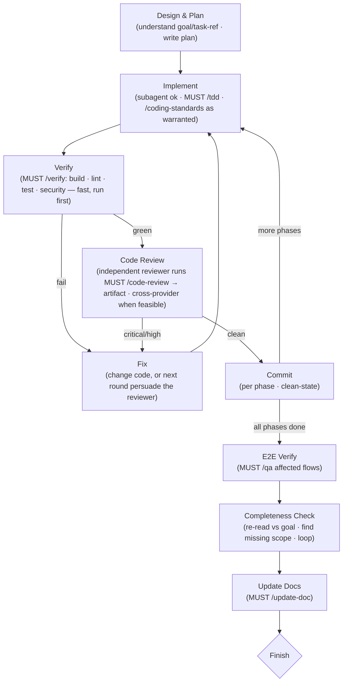

# Implement

Given a goal or task (system design, feature, refactor), drive it from plan to done.

## Usage

`/implement [goal or task reference]`

Accepts either a freeform **goal** or a **task reference** (a task id or design-doc
path). A goal is taskless — write your plan to a file (Step 1) and go; you do not need a
task-graph entry. A task reference already carries scope · acceptCriteria · depends —
read it as your contract.

## Principles

Think like Linus Torvalds. Design from first principles.

- KISS — avoid over-engineering, keep nesting shallow
- Minimal redundancy — if simpler logic does the same thing, use it
- Turn edge cases into canonical cases through smart design, not special-casing
- High readability — code should be self-evident
- No backward compatibility hacks — only the latest, best implementation matters
- Read existing code first, align with codebase conventions
- Use `/ultra-think` for critical or complex design decisions

## The recipe

The steps are a **fixed flow**. *How* you run each one — the prompt, whether you spawn
a subagent, which tools — stays self-directed, but the shape does not change. **Every
step that names a skill MUST USE it** (prose enforcement — do not skip the boring tail):

Within a phase, **`/verify` and `/code-review` are peer gates** on the commit — both must
pass, and you run `/verify` first because it's deterministic and fast, so it fails before
you spend a reviewer on code that doesn't build. `/qa` is a different gate at a different
cadence: the end-to-end check over **affected user flows**, run **once after all phases
land** — not a per-phase peer. `/verify` (unit-level build · lint · test · security) and
`/qa` (E2E) never substitute for each other.

## Step 1: Design & Plan

Come up with a phased implementation plan. Write your plan to a file.

- If the scope is large, break into multiple phases
- If the scope is reasonable, treat as a single phase
- Each phase should be independently committable

Output a plan with phases, affected files, and key design decisions.

## Step 2: Phased Execution

For each phase, repeat 2.1 → 2.5. **`/verify` and `/code-review` are peer gates on the
commit** — both must be green before you commit; run `/verify` first to fail fast.

### 2.1 Implement
- Execute the phase, ideally in a fresh subagent for context cleanliness
- Use `/coding-standards` and `/tdd` (**MUST USE the mentioned skills**) when the logic warrants it

### 2.2 Verify
- Run `/verify` (**MUST USE**) — build · lint · test · security. Deterministic and fast, so run it first: no point spending a reviewer on code that doesn't build. Get it green before review.

### 2.3 Code Review
- Run `/code-review` (**MUST USE**) with an **independent reviewer**.
  - **Minimum:** independent context — a fresh subagent that did not write the code.
  - **Preferred (cross-provider, when feasible):** a *different provider* reviews — a
    Claude worker starts a Codex reviewer, and vice versa, via
    `yaco agent start <opposite-provider> "..." --wait` then `yaco agent kill`
    (start → wait → kill). Nested sub-sessions are supported (spawnedBy/parentSession),
    so a worker may spawn its own reviewer. A reviewer of the same provider but separate
    context is the fallback when cross-provider isn't available.
- Write the review **artifact** to the same folder as the design doc (or project root), with a header that makes it verifiable evidence — not just prose: **reviewer** (handle / provider), the **base SHA and scope** it reviewed, **verdict**, and **unresolved critical/high count**. Anyone (or any gate) can then confirm the review covers the work and trust it by reading, without re-running it.

### 2.4 Fix
- Address `/verify` failures and `/code-review` issues (change the code, or in the next round persuade the reviewer the finding is wrong). Loop 2.1–2.4 until **both** gates are green.

### 2.5 Commit
- Git commit after every phase finishes.
- **Clean-state rule**: every commit must leave the branch buildable.

## Step 3: E2E Verification

Run `/qa` (**MUST USE**) to verify affected user flows end-to-end. `/qa` analyzes changes, derives impacted flows, and verifies with stack-appropriate tools (Playwright, HTTP calls, CLI tests).

## Step 4: Completeness Check

Re-read the whole diff against the original goal/task and hunt for **missing scope** — acceptance criteria or pieces you never built. This is a coverage gate, not a bug hunt: `/code-review`, `/verify`, and `/qa` all check *what's present*; only this step catches what's **absent**.

**If anything is missing, loop back to Step 1 to re-plan for the gap and continue.**

DO NOT STOP UNTIL THE TARGETED SCOPE IS FULLY IMPLEMENTED.

## Step 5: Update Docs

Run `/update-doc`  (**MUST USE the mentioned skills**) to sync `doc/main/`, `doc/dev/`, project-local skills in `./.claude/skills/*`, and `doc/PROGRESS.md` with the changes.

## Finish

`/implement` is done when the targeted scope is fully implemented, verified, and
documented, and you have stopped. Producing that finished state is the whole job;
recording task-graph status is outside its scope.

## Context Management

- Use TodoWrite to track phases and progress
- Use subagents to keep context windows fresh
- Compact context at phase boundaries when needed
