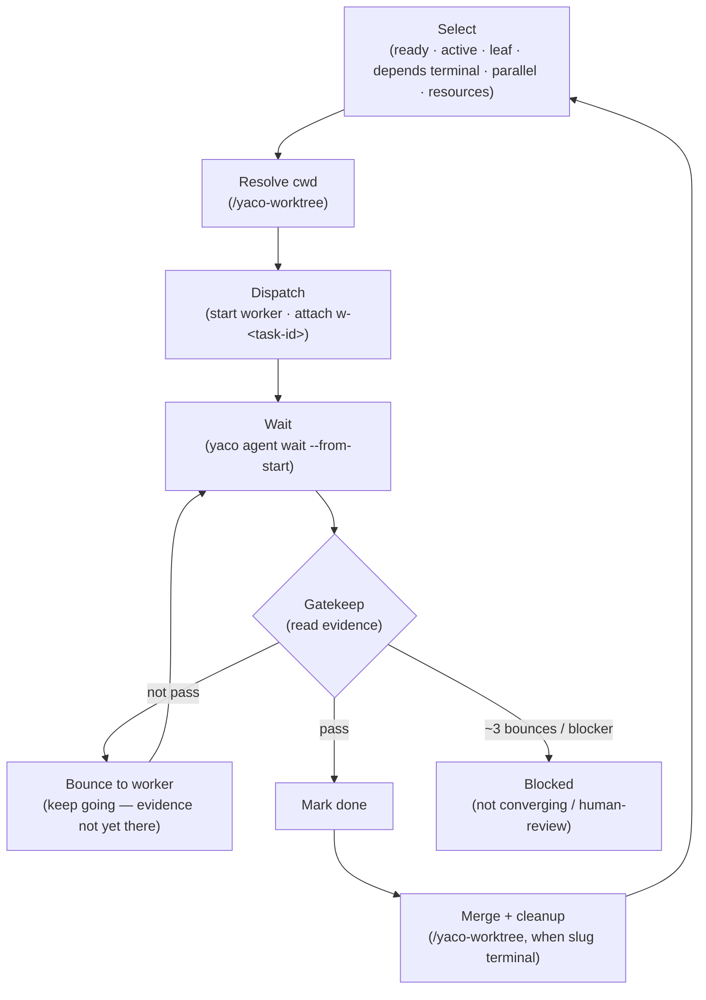

Read the task graph (`/yaco-task`), dispatch `/implement` workers (`/yaco-agent`),
**gatekeep** their output, and drive worktrees (`/yaco-worktree`). Every `yaco` call
MUST pass `--json` and use the canonical `yaco agent start <provider>` form; the task
graph path resolves from yaco.toml (`/yaco-paths`).

A worker is just `/implement <task>` in its own session. Orchestrate never re-runs the
leaf recipe — it **selects** work, **dispatches**, **gatekeeps by reading evidence**,
and **merges**.

## Flow



## Select

Read the active workset (`yaco task list --json`). Select tasks where ALL of:

- state `ready`, workset `active` (the CLI list surface filters this by default)
- task is a **leaf** (no other task has it as `parent`)
- all `depends` are terminal (done/cancelled)
- passes the parallelism check (below)
- `resources` (if set) are free — judge by running checks (ports/processes), counting resources held by running tasks, tasks already picked this batch, and external processes outside the project (e.g. `lsof -i :9222`)

**Parallelism — two independent levels:**

| Level | isolates | rule |
|-------|----------|------|
| Worktree | `node_modules`, build, git index | different `worktree` slug → **always parallel** |
| Task | source files | same worktree / both main checkout → **scope-overlap check** |

So: different worktrees → always parallel; same worktree (or both in main checkout) →
dispatch only if scopes don't overlap; a worktree task + a main-checkout task → always
parallel.

**Ordering** (tiebreak only — all non-overlapping eligible tasks dispatch in parallel):

1. scope overlap in the same worktree → higher priority wins (`critical > high > normal > low`)
2. agent concurrency capped → priority gets the slot first
3. same priority → fewer depends → smaller estimate → alphabetical

## Dispatch

Resolve the cwd (`/yaco-worktree`), record the pre-work baseline, set the task `running`, start the worker, attach its handle:

```bash
base="$(git -C <resolved_cwd> rev-parse HEAD)"   # capture BEFORE the worker commits — scopes the task diff
yaco task set <task-id> --data '{"state":"running"}' --json
cd <resolved_cwd> && yaco agent start claude "/implement <task-ref> — <task-context>" --name "w-<task-id>" --json
yaco task attach <task-id> w-<task-id> --json
```

- **Implementation leaf** → the worker runs `/implement <task>`. The prompt carries task title, acceptCriteria, design-doc path, scope, and the **worker contract**: complete the recipe, then **stop and report — do not mark the task `done`** (orchestrate gatekeeps that).
- **Non-implementation leaf** (docs/design/planning — no code recipe) → dispatch the task prompt directly, no `/implement`.
- `$base` is the gate's diff scope: the task's work is `git diff $base..HEAD` in the cwd.
- `yaco task attach` is an idempotent delta on the task's `agents` list — never write session links through `yaco task set` (the legacy `agent` field is rejected). Detach with `yaco task detach`.

Then **wait** for the worker: `yaco agent wait w-<task-id> --from-start --json`.

## Gatekeep

Orchestrate's core job: **decide done by reading evidence — never by redoing the work,
never by trusting the worker's word.** The worker's `/implement` already produced the
evidence; orchestrate confirms it exists and is clean.

**Gate criteria** — read the evidence; a criterion passes only when present *and* clean:

| criterion | required | passes when |
|-----------|----------|-------------|
| acceptCriteria | always | every item independently checks out — file → `test -f`; command → run it, check exit; observable → read files / `git diff <base>..HEAD` |
| independent review | impl leaf | reading `git diff $base..HEAD` yourself, you confirm a `/code-review` artifact from an **independent reviewer** (≠ the worker) covers that diff with **no unresolved critical/high**. A changed hunk no artifact covers = unreviewed → not a pass |
| verify | impl leaf | `/verify` is green (re-run it, or read its result) |
| qa | user-facing change | `/qa` exercised the affected flows |

Orchestrate does **not** re-review: the worker's reviewer was already independent
(cross-provider), so a second review of the same diff adds nothing. It instead checks the
review **artifact** against the **real diff it reads itself** (`$base..HEAD`) — the artifact's
provenance (reviewer, base, scope) is what it cross-checks coverage against, so a stale or
self-authored one can't pass. This is a judgment over evidence you can see, not trust in the
worker's word. The artifact lands in the design-doc folder (`/yaco-paths`).

**Outcome:**

- **Pass** (every criterion present + clean) → `yaco task set <task-id> --data '{"state":"done"}' --json`. (If `requireHumanReview: true` → `blocked` / `blockReason: "human-review"` instead; report and wait.)
- **Not pass** (any criterion missing *or* failed — no review artifact, unresolved critical/high, `/verify` red, acceptCriteria unmet) → **bounce** the worker to keep going: `yaco agent send w-<task-id> "<what's missing or failing> — finish it" --wait --json`, then re-gate. This is the worker completing its own recipe, not orchestrate driving fixes — and it's the whole point of the gate: a worker can't claim done until the evidence is actually there.
- **Not converging** — after ~3 bounces with no progress, or an unresolvable blocker (needs a human decision) → `blocked`, `blockReason: "verification-failed"`, note which criterion. Keep scanning other ready tasks.

**Non-implementation leaf** → gate on acceptCriteria evidence only.

## Worktree completion

When a worktree task reaches a terminal state, run the per-slug **completion check**
(`/yaco-worktree`): all siblings terminal → merge, then cleanup (`local` now, `pr` after
the PR merges). On merge failure, `/yaco-worktree` sets the **triggering leaf** back to
`blocked` / `blockReason: "merge-conflict"` (not the milestone parent).

## Auto-Continue

After each batch, scan for newly-ready tasks and dispatch. **Stop only when:**

- a `requireHumanReview: true` task completes → report and wait for human input
- **circuit breaker**: 3 consecutive task failures with no success in between → stop and report all failures
- no more ready tasks → report final status

On a human-review stop the human may **approve** (→ `done`), **request changes**
(→ `ready` + note), or **abandon** (→ `cancelled`).

## Blocked

A `blocked` task: report it (read `note` / `blockReason`) and skip. Don't auto-unblock —
blocked tasks need human intervention or dependency resolution.
