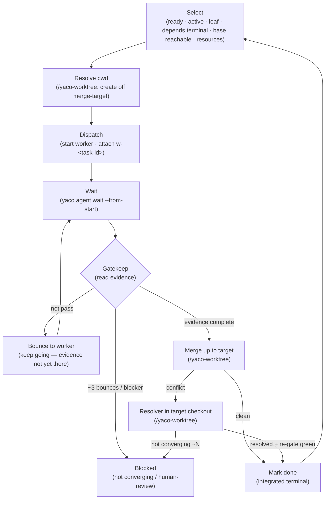

Read the task graph (`/yaco-task`), dispatch `/implement` workers (`/yaco-agent`),
**gatekeep** their output, and merge up the worktree/branch DAG (`/yaco-worktree`). Every `yaco`
call MUST pass `--json` and use the canonical `yaco agent start <provider>` form; the task graph
path resolves from yaco.toml (`/yaco-paths`).

A worker is just `/implement <task>` in its own session — orchestrate never re-runs the leaf
recipe, it gatekeeps by **reading evidence**. The model is **task DAG ≅ worktree/branch DAG**
(`/yaco-worktree`): a runnable leaf merges up into its target only after it passes the gate.

## Flow



## Select

Read the active workset (`yaco task list --json`). Select tasks where ALL of:

- state `ready`, workset `active` (the CLI list surface filters this by default)
- task is a **leaf** (no other task has it as `parent`)
- all `depends` are terminal (done/cancelled)
- **base reachable** — the leaf's merge target already contains every terminal `depends`
  predecessor. Same-target predecessors are there automatically; a **cross-target** predecessor
  (a `depends` edge crossing a milestone boundary, merged elsewhere) that is **not reachable from
  the target** is a graph/target authoring error → **skip and flag, don't dispatch** (v1 doesn't
  auto-import across targets; fix by co-locating the leaves under one integration milestone, or
  depend on the whole merged-up milestone).
- `resources` (if set) are free — judge by running checks (ports/processes), counting resources held by running tasks, tasks already picked this batch, and external processes outside the project (e.g. `lsof -i :9222`)

**Parallelism.** Because each leaf is isolated, **all eligible leaves dispatch in parallel** —
there is no scope-overlap serialization. The only limits are agent concurrency and `resources`.
Overlapping scopes are resolved at merge-up (isolation + merge), not prevented. Correctness
ordering is expressed as `depends`, **never inferred from `scope`**.

**Ordering** (tiebreak only — when agent slots or resources are scarce; otherwise everything eligible dispatches):

1. higher priority wins (`critical > high > normal > low`)
2. when slots are scarce, prefer **disjoint scopes** to minimize later merge conflicts — a hint, never a blocker
3. same priority → fewer depends → smaller estimate → alphabetical

**Slug.** Defaults to the task id; an explicit `worktree` only renames the branch. **Two runnable
leaves must not share a slug** — a duplicate is an authoring error; block before dispatch.

## Dispatch

Resolve the cwd (`/yaco-worktree`): ensure the merge-target branch exists, create the leaf's own
worktree off it, record the pre-work baseline, set the task `running`, start the worker, attach its
handle:

```bash
# 1. Target = nearest integration-milestone ancestor branch, else main. When it's a milestone,
#    create/reuse its worktree first so the branch exists:
yaco worktree create <milestone-slug> --base <parent-target> --json   # only when target is a milestone
target="task/<milestone-slug>"                                        # else: target="main"
# 2. Leaf's own worktree, off target:
slug="<worktree field | task-id>"
cwd="$(yaco worktree create "$slug" --base "$target" --json | jq -r .data.path)"
base="$(git -C "$cwd" rev-parse HEAD)"   # capture BEFORE the worker commits — scopes the task diff
yaco task set <task-id> --data '{"state":"running"}' --json
cd "$cwd" && yaco agent start claude "/implement <task-ref> — <task-context>" --name "w-<task-id>" --json
yaco task attach <task-id> w-<task-id> --json
```

- **Implementation leaf** → the worker runs `/implement <task>`. The prompt carries task title, acceptCriteria, design-doc path, scope, and the **worker contract**: complete the recipe, then **stop and report — do not mark the task `done`** (orchestrate gatekeeps and merges that).
- **Non-implementation leaf** (docs/design/planning — no code recipe) → dispatch the task prompt directly, no `/implement`.
- `$base` is the gate's diff scope: the task's work is `git diff $base..HEAD` in the cwd.
- `yaco task attach` is an idempotent delta on the task's `agents` list — never write session links through `yaco task set` (the legacy `agent` field is rejected). Detach with `yaco task detach`.

Then **wait** for the worker: `yaco agent wait w-<task-id> --from-start --json`.

A `wait --from-start` returns at the worker's **first** idle — which, with background tasks or sub-agents in play, isn't necessarily the whole turn finishing: the worker can autonomously re-enter `processing` afterward, so the return is a cue to **gate**, not proof of done.

## Gatekeep

Orchestrate's core job: **decide done by reading evidence — never by redoing the work,
never by trusting the worker's word.** The worker's `/implement` already produced the
evidence; orchestrate confirms it by reading **one `yaco gate` result**, not by walking
several ad-hoc paths. Run it against the worker's diff in the leaf's cwd:

```bash
yaco gate --base "$base" --json    # $base = the pre-work baseline recorded at Dispatch
```

Its single envelope `{ ok, data:{ base, sha, checks, dirty } }` is the floor evidence,
computed from the diff (not the worker's word): `data.checks` reports `verify · doc ·
review · qa` (each pass/fail/skip) and `data.dirty` flags an uncommitted (stale)
worktree. One read replaces re-running `/verify`, hunting the review artifact, and
re-deriving qa flows by hand.

The gate floors evidence from the **diff**, so two things stay orchestrate's own to
confirm on top of it:

| overlay | passes when |
|---------|-------------|
| acceptCriteria | every item independently checks out — file → `test -f`; command → run it, check exit; observable → read files / `git diff $base..HEAD`. (The gate never reads the task.) |
| review independence | the same review artifact the gate already counted is from an **independent reviewer** (≠ the worker, cross-provider) and covers the diff you read — a single targeted read of its provenance header (reviewer, base, scope) in the `/yaco-paths` bundle home. This is the one authorship check the diff-only gate can't make in v1 (its `review` check is existence + sha-fresh only); without it a worker's self-authored review would pass. |

**Outcome:**

- **Pass** (`data.checks` all pass/skip, `data.dirty` false, acceptCriteria met, review independent) → the leaf is **ready to merge, not yet `done`**. Proceed to **Merge up**; mark `done` only after the merge lands. (If `requireHumanReview: true` → `blocked` / `blockReason: "human-review"` instead; report and wait.)
- **Not pass** (any `data.checks` fail, `data.dirty` true, acceptCriteria unmet, or review not independent) → **bounce** the worker to keep going: `yaco agent send w-<task-id> "<what's missing or failing> — finish it" --wait --json`, then re-gate. This is the worker completing its own recipe, not orchestrate driving fixes — a worker can't claim done until the evidence is actually there.
- **Not converging** — after ~3 bounces with no progress, or an unresolvable blocker (needs a human decision) → `blocked`, `blockReason: "verification-failed"`, note which check. Keep scanning other ready tasks.

**Non-implementation leaf** → no code diff, so the gate's code checks skip; gate on acceptCriteria evidence only.

## Merge up

A gate-passed leaf becomes `done` **only after it merges up** into its target — terminal = gate
passed + merged up. Mechanism (target rule, native-git vs `yaco worktree merge`, resolver protocol,
per-target write serialization) lives in `/yaco-worktree`; orchestrate drives it:

1. Merge `task/<leaf>` into its target. **Clean** → set the leaf `done`; cleanup once the branch has landed.
2. **Conflict** → dispatch a resolver in the target checkout and re-run the resolver gate (`/yaco-worktree`). Resolved + re-gate green → `done`. Not converging (~3 rounds) → set the **triggering leaf** `blocked` / `blockReason: "merge-conflict"` (not the milestone parent).
3. **Integration milestone** — when all its children are integrated-terminal, run the milestone's `acceptCriteria` in its integration worktree, then merge the milestone branch up to its own target (the same rule, one level higher).

## Auto-Continue

After each batch, scan for newly-ready tasks and dispatch. **Stop only when:**

- a `requireHumanReview: true` task completes → report and wait for human input
- **circuit breaker**: 3 consecutive task failures with no success in between → stop and report all failures
- no more ready tasks → report final status

On a human-review stop the human may **approve** (→ merge up per **Merge up**, then `done` once it
lands), **request changes** (→ `ready` + note), or **abandon** (→ `cancelled`).

## Blocked

A `blocked` task: report it (read `note` / `blockReason`) and skip. Don't auto-unblock —
blocked tasks need human intervention or dependency resolution.
