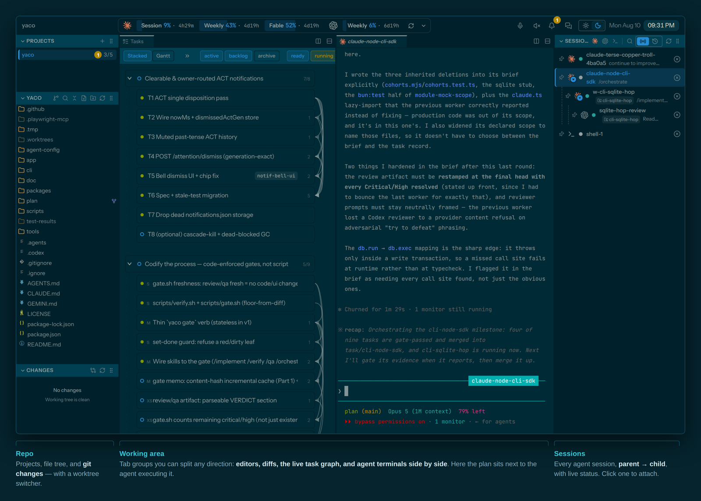
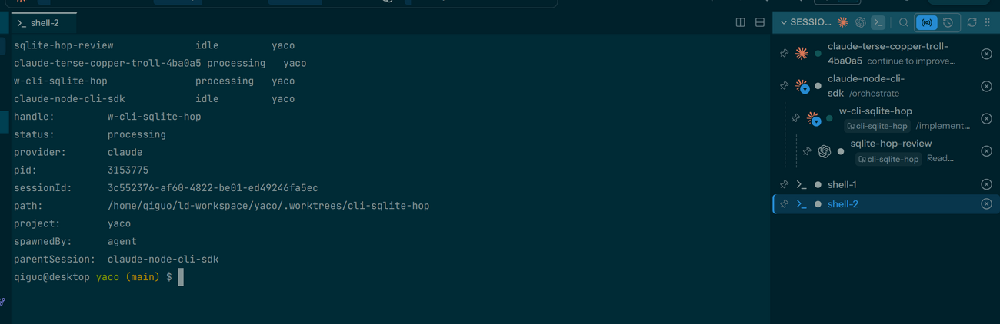
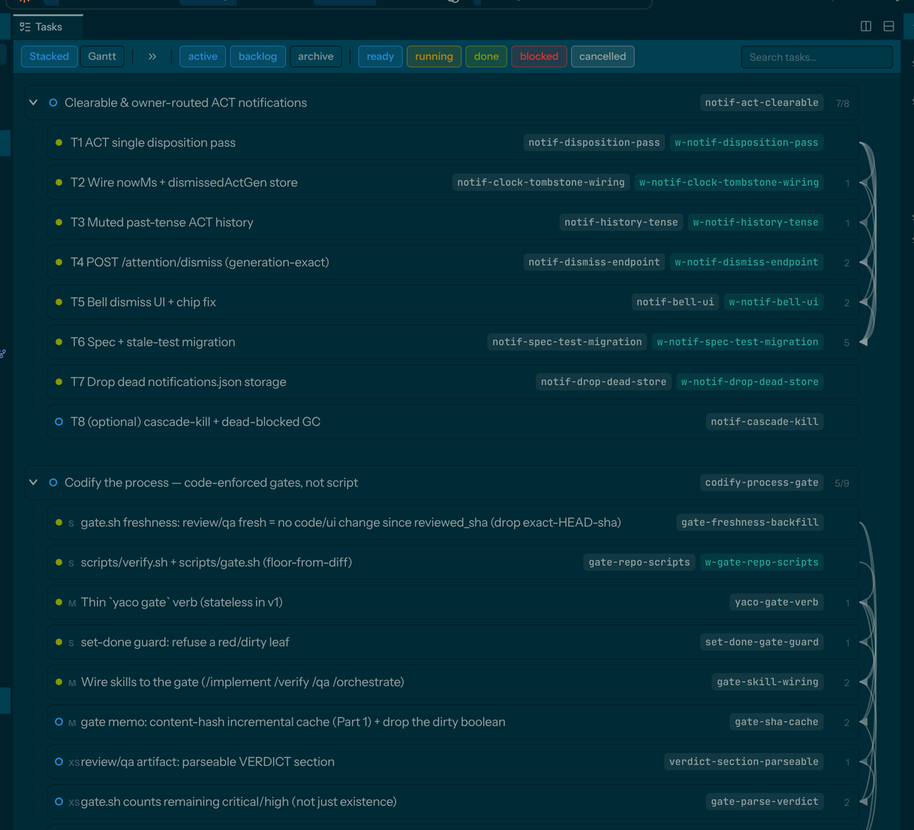
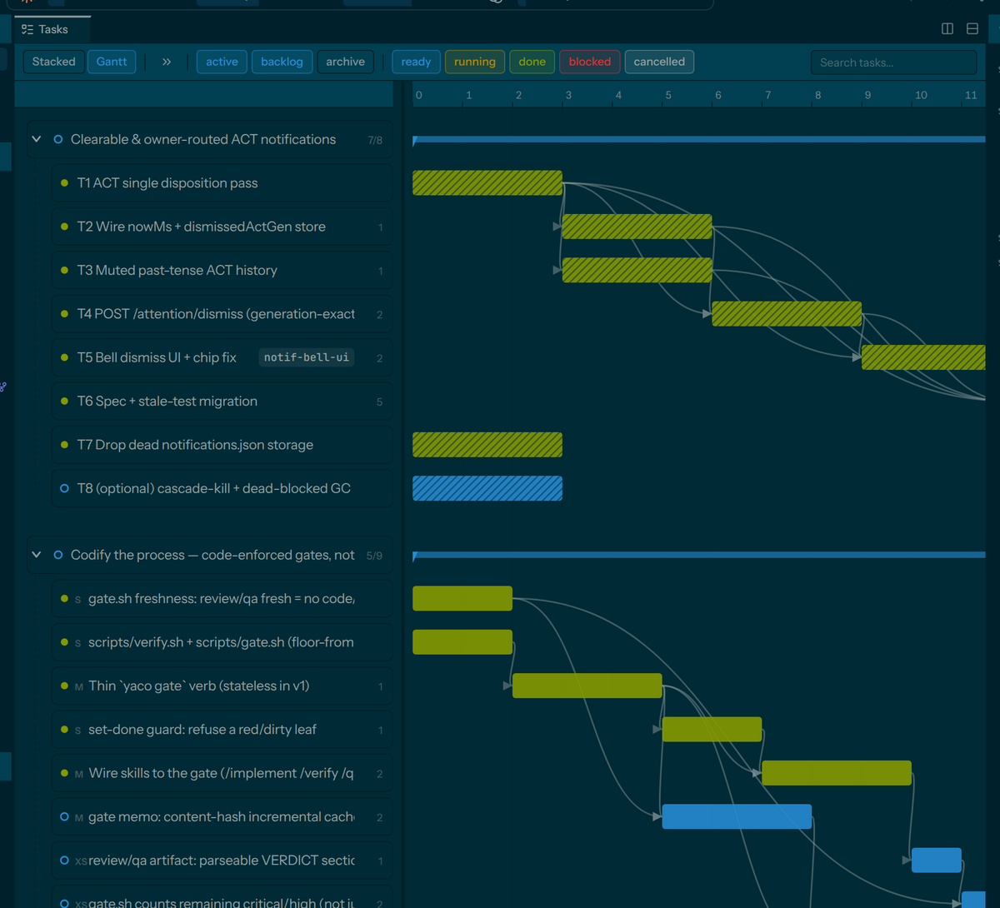
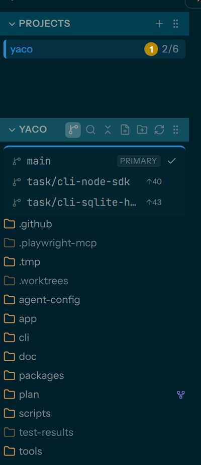
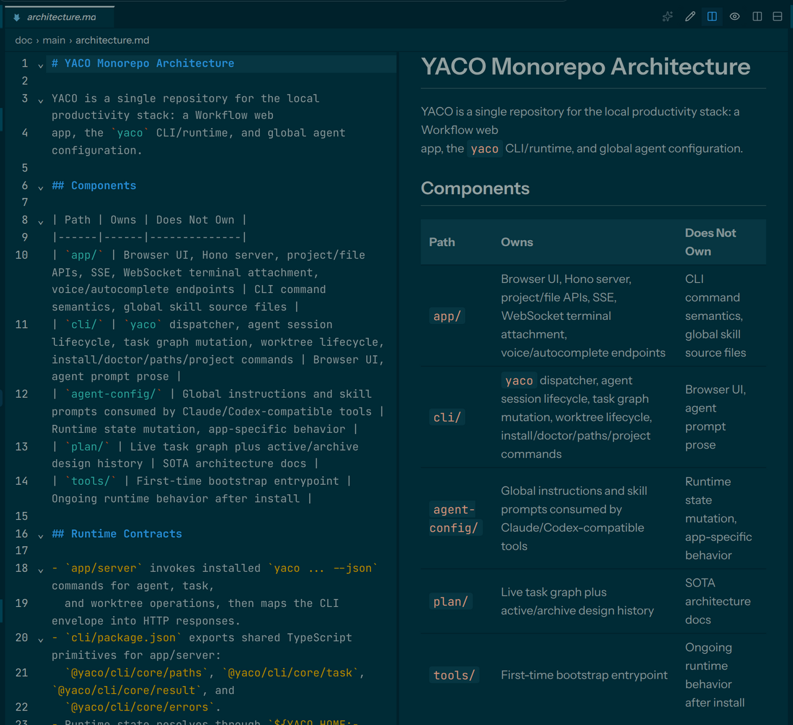
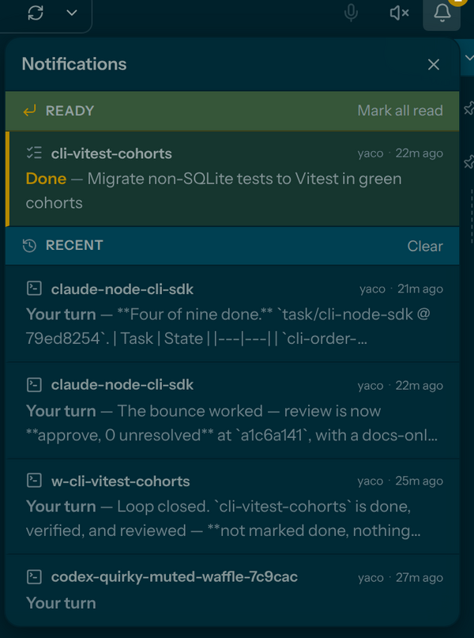
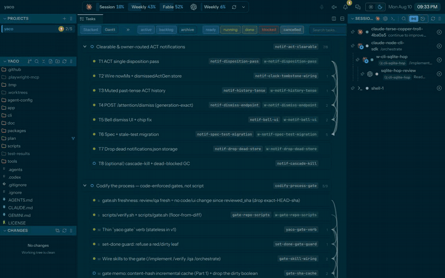
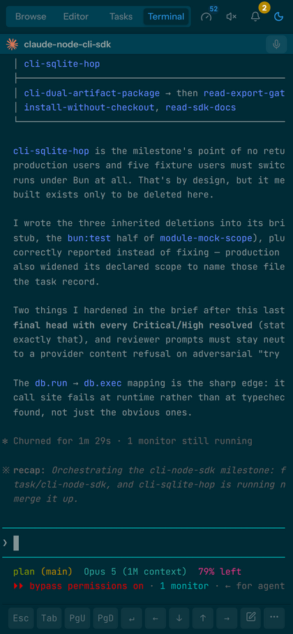

# Visual Tour

What the app looks like in use. Every screenshot is this repo, driving its own
agents — nothing staged.

## Owns

- User-facing screenshots of the app and the captions that explain them

## Does Not Own

- Behavior specs (see [ui/](ui/)) and component/state detail (see [frontend/](frontend/))
- Capture tooling — the shots are taken by hand against a running instance

## The layout

Three regions, and the middle one is the whole app:

- **Left** — projects, the file tree (with the worktree picker in its header),
  and git changes.
- **Middle** — tab *groups*. Each group holds an ordered strip of editors,
  diffs, terminals, and the Tasks tab, and any group can split right or down.
  Editors and agent terminals sit side by side because they are the same kind
  of thing here.
- **Right** — live agent sessions, nested parent → child, with status dots and
  worktree badges. Clicking one attaches a terminal to it.

## Sessions are the point

The CLI and the app read the same session state. `spawnedBy: agent` plus
`parentSession` is the entire lineage model — an orchestrator started
`w-cli-sqlite-hop` in a worktree, and that worker started its own Codex
reviewer. All three are sessions you can list, capture, attach to, or kill,
whoever created them.

Every terminal is a tmux session, so closing the tab, restarting the server, or
switching devices doesn't end anything.

## The plan, rendered

`plan/tasks/` rendered live: milestones with their tasks, per-task state, and
the worktree slug each one runs in. Workset (active / backlog / archive) and
state are filters, not separate screens.

The Gantt view draws the real `depends` edges. Hatched bars are estimates the
graph assumed rather than ones you wrote down.

## One task, one checkout

`yaco worktree` puts each task on `task/<slug>` under `.worktrees/`. The
explorer header switches the entire workspace — files, git, diffs, drafts —
between them, while your terminals keep running where they are.

## Docs are first-class

Markdown opens with source and render side by side, scroll-synced, with mermaid
rendered inline — because the `/design` and `/discuss` loops mean reading and
editing the same doc an agent is writing into.

## Attention, not polling

Sessions and tasks raise their own notifications with the actual content, not a
template. The bell dismisses them; the history tab keeps the past ones in
muted past tense.

## Watch it work

Open the task graph, split the working area, attach to the agent that is
executing the plan — the diff it is applying streams in the pane next to the
task list.

## From your phone

The same workspace, laid out for a small screen: Browse / Editor / Tasks /
Terminal instead of docks, a key bar for the terminal keys a phone keyboard
lacks, and voice input for writing prompts. Reach it over Tailscale or whatever
you already use.
