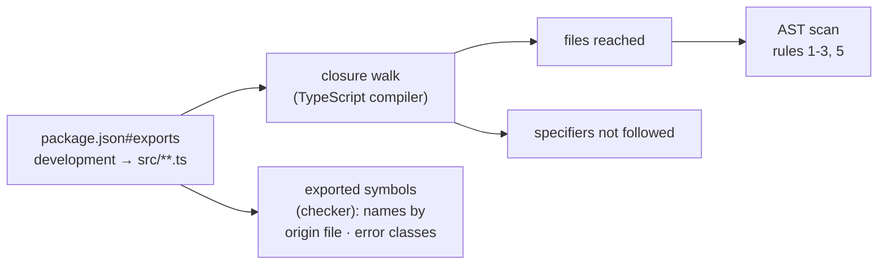

# Export Eligibility (`cli/package.json#exports`)

> What `@yaco/cli` may publish for in-process use, and the audit that decides it.

Last updated: 2026-08-11 (summary-read-cutover: `core/agent/summaries`, the provider catalog, and rule 5's first judged `node:sqlite` admission) · Code: `cli/test/unit/export-audit.test.ts`, `cli/test/helpers/export-closure.ts`, `cli/test/bench/{history,summary}-stall.ts` · Parent: [README.md](README.md)

`app/server` imports all eight exported subpaths in process today —
`core/paths`, `core/task`, `core/agent`, `core/agent/messages`,
`core/agent/summaries`, `core/worktree`, and the `core/result` / `core/errors`
failure vocabulary that shared reads answer in. Each import is a piece of the
CLI running inside the app's event loop, under the app's lifetime — so what an
export may *contain* is a contract, not a preference. The six rules below come
from the `cli-node-sdk` design; the audit enforces them over each export's
**transitive production import closure**, and nothing is grandfathered.

Eligibility is necessary and not sufficient. A route also has to be a read
rather than a mutation, and it has to measure a starvation bound no worse than
the subprocess route it replaces — the history read passes this audit and stays
a subprocess for that reason. -> See: [read-path.md](read-path.md)



## The rules

| # | Rule | How it is enforced |
|---|------|--------------------|
| 1 | Per-request state (repo root, session, deadline) is explicit; process-wide roots stay ambient only under the closed allowlist `YACO_HOME`, `HOME`, `YACO_AGENT_SESSIONS_DIR` | AST: every `process.env` read in the closure, by literal name. A fourth name fails; a read whose name is not a literal fails as well, since an audit that cannot see the name cannot bound the surface. `process.cwd()` likewise |
| 2 | No `process.exit`, no `process.exitCode`, no stdout/stderr ownership | AST, including `process["exit"]`, `globalThis.process`, and any reference to `process` outside a member access — `const runtime = process` hands every banned member a name the scan cannot follow |
| 3 | No polling loop, synchronous sleep, `execSync`, `execFileSync`, `spawnSync` | AST at the import site (on the *original* name, so an alias cannot hide one) and the call site. Polling means an unbounded loop or a loop that sleeps — **not** a loop of awaits, which is what rule 5 asks a chunked reader to be |
| 4 | Any subprocess, network request, lock or retry is asynchronous, caller-deadlined, abortable, cleaned up | Behavioural. Vacuous today, and kept so by the census and the mutation ban: no eligible closure contains any of those |
| 5 | Recursive or input-sized filesystem work is asynchronous; single bounded reads may stay synchronous | AST, failing closed: every `…Sync` name is unbounded unless it is on the bounded allowlist. One tracked debt — see below |
| 6 | One failure vocabulary: `CliError` / `Result` | Compiler: no export publishes a class extending `Error` other than `CliError` |

## The audit

`cli/test/unit/export-audit.test.ts` is the gate; `test/helpers/export-closure.ts`
is the walker. It uses the TypeScript compiler's parser and module resolver
rather than a regular expression, because the two shapes that decide the answer
are one AST node apart:

- **a re-export** (`export { runGit } from "./git.ts"`) is an edge with no
  `import` statement anywhere in the file — a regex misses it;
- **`import type … from`** is erased and is *not* an edge — counting it makes the
  audit cry wolf until someone turns it off.

An inline `import { type A } from "m"` *is* an edge: under
`verbatimModuleSyntax` it still emits `import {} from "m"`. A literal
`import("m")` is an edge too — laziness changes when a module loads, not
whether it ships. A computed dynamic specifier is unauditable and throws.

Four things are checked in per export, so any widening is a failing diff rather
than an invisible new edge:

| Pin | Catches |
|---|---|
| the file closure | a new module reachable from an export |
| the unwalked specifiers | a new package dependency inside an export closure (today: Node builtins only — `smol-toml`, the CLI's one runtime dependency, is in no closure) |
| the exported names, **grouped by the file each one comes from** and resolved through its alias chain (`public=origin` when the two differ) | `export { saveTasks as loadTasks }`, which leaves both the name and the file census intact — and a same-named writer added to a file the closure already contains, which leaves the name intact too |
| the exported error classes | a second failure vocabulary |

Excluded subsystems (tmux, reconciliation, lifecycle, usage, mutation,
synchronous sleep) are named by file and asserted unreachable — **and asserted
to exist**, so a rename cannot quietly empty the list. No closure reaches
`src/commands/**` or `src/main.ts` at all.

The last block of the test audits the auditor: the identical walker runs over
throwaway fixture trees planting each evasion above, and its verdict is
asserted. A gate nobody has watched fail is not known to work.

## What this cost the barrels

- **`core/worktree`** publishes `validateSlug`, `worktreePath`, `worktreeBranch`
  and nothing else. `git`, `create`, `merge`, `cleanup`, `pr` spawn git or gh
  synchronously and read `process.cwd()`; `cli/src/commands/worktree/*` imports
  those modules directly. -> See: [worktree.md](worktree.md#convention-export)
- **`core/task`** publishes the model, the pure graph analysis and the read half
  of the store. The writers, the tasks-file lock, `archive.ts` and `link.ts` are
  gone from the barrel: task mutation is one authority — lock, repository gate,
  write — and half of it inside an app process is how two writers end up
  disagreeing about who owns the file. -> See: [task.md](task.md#files)
- **`DEFAULT_TASK_LOCK_TIMEOUT_MS`** lives in `task/model.ts`, not `lock.ts`, so
  `app/server` can have the number without the polling loop attached to it.
- **`YACO_TASK_LOCK_TIMEOUT_MS`** is read only at
  `cli/src/commands/task/lock-timeout.ts` and passed down as an explicit
  `AcquireOptions.timeoutMs`. -> See: [task.md](task.md#locking)
- **`TomlParseError`** is deleted; `parseScopedToml` raises
  `CliError(ENV, "yaco.toml:<line>: …")` — no `details`, so the envelope is
  byte-identical to what the deleted class's translation produced, and the line
  number stays where it always was, in the message.
  -> See: [paths.md](paths.md#files)

- **`core/agent/messages`** publishes one verb, `readMessageRows` — a per-subpath
  export rather than a widening of the `core/agent` barrel, because the barrel's
  pinned census is a file two other Phase-2 cutovers also have to edit. It
  publishes `messagesForProvider` as the *only* answer to which reader a provider
  uses: the TUI registry reaches tmux and the session lifecycle, so the read side
  keeps its own two-entry lookup and a test fails closed when a registered
  provider is missing from it. (`TuiProvider.messages` was that check's original
  subject and is now deleted — it was a shadow of this registry, and a provider
  that simply omitted the flag slipped past.) `validateName` rides along because
  an in-process caller resolves the handle itself and must reject exactly what
  `agent messages` rejects.
  -> See: [providers.md](providers.md#message-inventory)

Getting there cost `providers/output.ts` its follower: `followOutput` polls, and
the message read reaches `output.ts` for provider log paths. The tailer is now
`providers/follow.ts`, which no export reaches.

- **`core/agent/summaries`** publishes `readSessionSummaries` and the
  `summarizerForProvider` registry, on the same terms and for the same reason.
  Its closure is the shared provider-log path resolver, the label-collapsing
  rules (`providers/prompt-label.ts`, extracted so the history list and the
  summary read cannot drift), and `providers/provider-home.ts` — one definition
  of `$HOME`-at-call-time, which retired three copies. It reaches neither
  `history.ts`, whose provider scans are unbounded, nor `session-state.ts`,
  which is a mutation module: the sessions are explicit inputs.
  -> See: [providers.md](providers.md#session-summaries)

- **`core/agent`** gained the provider catalog and nothing else. It is the only
  part of the provider registry an in-process caller may hold — the adapters
  reach tmux, hook installation and the lifecycle — so the identity lives in
  `provider-catalog.ts` and the adapters spread it. The audit asserts both halves
  of "static metadata" directly: the module reaches **no specifier at all**, so
  it can call no filesystem API, and it reads no environment name.

`core/paths` still publishes its registry writers (`addProject`,
`removeProject`, `writeProjects`) on purpose: the app server is the CLI's peer
on `projects.json`, not a reader of it, and one implementation of that on-disk
shape beats two.

## The tracked debt, and how it was paid

Rule 5 shipped owing exactly one thing: `loadTaskStore` walked the task tree
with a synchronous recursive `readdir` while `app/server` called it in process.
It was pinned in `RULE_5_DEBT` as the **exact finding multiset**, not by file —
waiving the file would have hidden every further traversal added to it — and
the audit was written to fail the moment the list stopped matching.

Phase-2 cutover 1 paid it. `store.ts` now reads through `fs/promises`: the walk
is depth-first with one `readdir` per await, and the file set is read
`READ_CONCURRENCY` at a time. `RULE_5_DEBT` is empty, and "no violation in any
exported closure" passes with no rule-5 filter left to apply.

Depth-first is load-bearing rather than stylistic: it is what decides *which*
unreadable directory a broken tree names, and that message is in the CLI
envelope and the app's HTTP failure body.
-> See: [task.md](task.md#reading)

The empty list stays, because it is the shape of the check and not a waiver: a
new synchronous traversal in an exported closure fails the audit, and admitting
one means writing it down there with the task that retires it.

## The queries rule 5 has judged

Rule 5 admits a `node:sqlite` query only against a measured stall bound, because
`node:sqlite` is synchronous. Two have been put to that test. The first was
refused; the second is the list's only entry.

### The admission, and its shape

`RULE_5_SQLITE` in the audit is the **opposite of `RULE_5_DEBT`**: a debt is owed
and has a task that retires it, an admission is permanent and has a measurement.
Today it holds one site — Codex's per-session
`SELECT title, first_user_message FROM threads WHERE id = ?`, which the summary
read cannot drop (on the reference home `first_user_message` is empty for most
recent threads, and `title` is the last-resort label).

What is admitted is **the code that was measured**. Adding `DatabaseSync` to
the walker's `BOUNDED_SYNC` list would have admitted `.all()` over a whole table
anywhere, invisibly — but so, it turned out, would any list of forbidden
constructs. Four versions of this check were written, and review found each one
incomplete:

| version | detects | does not detect |
|---|---|---|
| a text match | `.prepare(…).all()` | `const s = db.prepare(q); s.all()` |
| the callee name of a call | that | `s.all.bind(s)()`, a local binding shadowing `Promise` |
| property access | those | `const { all } = s`, `Reflect.get(s, "all")` |
| that plus a pinned import list | those | `(() => {}).constructor("… .all()")` |

The last row is why the approach was replaced rather than extended: every
function reaches `Function` through `.constructor`, and code inside a string is
not in the AST at all, so no list of names can be complete. In each case a
second, unbounded query ran while the audit reported exactly the admitted one.

So the admission carries two pins. `prepares` is the human-legible half — the
SQL a reader can hold against the measured bound. **`emitted` is the one that
means it: the JavaScript the module compiles to, checked in.** The audit asserts
the file still compiles to that, so any edit that changes the emitted program
fails — the cases above and the ones nobody has thought of alike, because none of them is something the check
has to recognize. Failing means re-judge and re-measure, which is what should
happen when the code carrying a measured stall bound changes.

It is the **build** config's emit — `tsc -p tsconfig.build.json`, the compilation
that produces `dist/**.js` — because that is the JavaScript an installed consumer
loads, with relative specifiers rewritten to `.js`. Compiling with the typecheck
config instead would leave a change confined to `tsconfig.build.json` free to
alter the shipped program while the pin stayed green, and the audit asserts the
rewritten specifier so the emit is provably the build's.

Pinning the emit rather than a summary of the syntax tree is a correctness
decision. A tree summary has to enumerate which node properties matter, and
review found one a `forEachChild` walk cannot reach at all: `const` / `let` /
`using` / `await using` live in `VariableDeclarationList.flags` rather than in a
child token, so `const row = …` and `using row = …` summarized identically while
emitting different programs — the second throwing at runtime and costing the
read its database inputs. The compiler's own output has no such gap, and it
normalizes exactly the right things: comments and type annotations are gone, and
the formatting is the emitter's rather than the source's. The fixture is 22
lines of ordinary JavaScript, which is also what makes a change to it legible.

Nothing but a single-purpose module can live under that, which is why the
admitted query sits alone in `providers/codex-thread.ts` rather than inside the
reader that uses it. **An admitted module is necessarily tiny, and that module's
existence and the shape of the rule are one decision rather than two.**

The measurement is reproducible rather than asserted:
`node cli/test/bench/summary-stall.ts --sqlite-probe --home ~` prints the
database, the plan (`SEARCH threads USING INDEX sqlite_autoindex_threads_1
(id=?)`) and the open/get/close distribution — 0.3 ms at the p50 and the maximum
over 40 warm samples, on an 11.1 MB, 2 297-row database.

### The query that was refused

The history read (`yaco agent history`) was the first put to the test, and the
answer was not about the database.

`cli/test/bench/history-stall.ts` is the harness. It asks the design's question
— how long an *already-queued* piece of work waits because of a route — by
re-queuing a timer for as long as the route runs and taking the worst delay,
once per invocation, under concurrent background load. Run it against a real
provider home or against the synthetic fixtures in `history-fixture.ts`:

```bash
node cli/test/bench/history-stall.ts --home ~ --project /abs/repo   # real
node cli/test/bench/history-stall.ts --scale 10                     # 10x synthetic
```

On a real provider home (11.6 MB `state_5.sqlite`, 2,275 Codex threads, 81
Claude logs), p95 starvation of an already-queued timer against route wall time:

| Route | p95 starvation | wall p50 |
|---|---:|---:|
| a child that prints an empty envelope — the spawn alone | 37.6 ms | 64 ms |
| subprocess — the route today | 42.3 ms | 344 ms |
| the shipped reader called in process | 79.2 ms | 142 ms |
| a bounded, chunked prototype of it | 12.8 ms | 103 ms |

Three things follow, and they are what a future rule-5 candidate should copy:

- **The database is not the cost.** The `threads` query is 4–9 ms. The cost is
  the per-row provider work it feeds — a 64 KB rollout tail per Codex row, a
  16 KB head plus 64 KB tail per Claude log, ~22 MB of parsing a request. Measure
  the whole read, not the query.
- **`spawn()` is not free either.** A child that reads nothing accounts for 37.6
  of the subprocess route's 42.3 ms, and still costs 15.9 ms with the app's
  `ssh-add` discovery removed — `fork` with a loaded heap. "Keep the subprocess"
  is not automatically the safe side of a starvation comparison. (Read that
  decomposition off the real home or `--scale 1`, not `--scale 10`: the harness
  builds the 550 MB fixture in the process it then measures.)
- **What fails the bound is the unbounded fan-out, not being in process.** The
  shipped reader reads every row a provider holds before the window is applied.
  `history-bounded-prototype.ts` caps each provider at the window and yields
  between chunks, and comes in under the bound at every chunk size from 1 to 16.

So the path is admitted — but only in that bounded form, and nothing is exported
yet: the shared read, its `core/agent` entry, an asynchronous origin lookup and
the audit pins land together in the follow-up cutover.

The session-summary read repeated the lesson from the other side.
`summary-stall.ts` carries a `whole-file` control route — the previous reader's
shape through the same call mechanism — and it is what makes the harness
falsifiable: bounded 13–22 ms p95 against unbounded 174–590 ms and a subprocess
route at 27–39 ms. Had the two measured alike, no figure the harness printed
about the in-process route would have meant anything. Review then found the one
thing chunking does *not* bound — a single input-sized record, whose decode and
parse are one uninterruptible unit — so the reader caps a record at 4 MiB and
`--long-record` is the fixture that holds it to the same bound.

## Invariants

- An export's `types` and `default` conditions are the `rootDir: src` /
  `outDir: dist` image of the `development` source the audit walks. Otherwise a
  published consumer could load a module nothing audited.
- The ambient allowlist is three names. Widening it is a design change, and the
  audit asserts the list itself.

## -> See

- [README.md](README.md) — CLI documentation map
- [read-path.md](read-path.md) — which routes these exports actually serve in process, what each move measured, and how to roll one back
- [paths.md](paths.md) · [task.md](task.md) · [worktree.md](worktree.md) — the barrels this governs
- [../../dev/cli/workflow.md](../../dev/cli/workflow.md) — build, test, and the two artifacts
