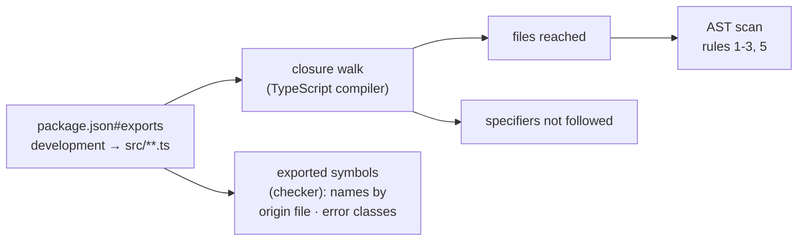

# Export Eligibility (`cli/package.json#exports`)

> What `@yaco/cli` may publish for in-process use, and the audit that decides it.

Last updated: 2026-08-11 · Code: `cli/test/unit/export-audit.test.ts`, `cli/test/helpers/export-closure.ts`, `cli/test/bench/history-stall.ts` · Parent: [README.md](README.md)

`app/server` imports four of the six exported subpaths in process today —
`core/paths`, `core/task`, `core/agent`, `core/worktree`. (`core/result` and
`core/errors` are published but not yet imported: the design keeps them as the
one failure vocabulary Phase 2's shared reads return.) Each import is a piece of
the CLI running inside the app's event loop, under the app's lifetime — so what
an export may *contain* is a contract, not a preference. The six rules
below come from the `cli-node-sdk` design; the audit enforces them over each
export's **transitive production import closure**, and nothing is
grandfathered.



## The rules

| # | Rule | How it is enforced |
|---|------|--------------------|
| 1 | Per-request state (repo root, session, deadline) is explicit; process-wide roots stay ambient only under the closed allowlist `YACO_HOME`, `HOME`, `YACO_AGENT_SESSIONS_DIR` | AST: every `process.env` read in the closure, by literal name. A fourth name fails; a read whose name is not a literal fails as well, since an audit that cannot see the name cannot bound the surface. `process.cwd()` likewise |
| 2 | No `process.exit`, no `process.exitCode`, no stdout/stderr ownership | AST, including `process["exit"]`, `globalThis.process`, and any reference to `process` outside a member access — `const runtime = process` hands every banned member a name the scan cannot follow |
| 3 | No polling loop, synchronous sleep, `execSync`, `execFileSync`, `spawnSync` | AST at the import site (on the *original* name, so an alias cannot hide one) and the call site. Polling means an unbounded loop or a loop that sleeps — **not** a loop of awaits, which is what rule 5 asks a chunked reader to be |
| 4 | Any subprocess, network request, lock or retry is asynchronous, caller-deadlined, abortable, cleaned up | Behavioural. Vacuous today, and kept so by the census and the mutation ban: no eligible closure contains any of those |
| 5 | Recursive or input-sized filesystem work is asynchronous; single bounded reads may stay synchronous | AST, failing closed: every `…Sync` name is unbounded unless it is on the bounded allowlist. One tracked debt — see below |
| 6 | One failure vocabulary: `CliError` / `Result` | Compiler: no export publishes a class extending `Error` other than `CliError` |

## The audit

`cli/test/unit/export-audit.test.ts` is the gate; `test/helpers/export-closure.ts`
is the walker. It uses the TypeScript compiler's parser and module resolver
rather than a regular expression, because the two shapes that decide the answer
are one AST node apart:

- **a re-export** (`export { runGit } from "./git.ts"`) is an edge with no
  `import` statement anywhere in the file — a regex misses it;
- **`import type … from`** is erased and is *not* an edge — counting it makes the
  audit cry wolf until someone turns it off.

An inline `import { type A } from "m"` *is* an edge: under
`verbatimModuleSyntax` it still emits `import {} from "m"`. A literal
`import("m")` is an edge too — laziness changes when a module loads, not
whether it ships. A computed dynamic specifier is unauditable and throws.

Four things are checked in per export, so any widening is a failing diff rather
than an invisible new edge:

| Pin | Catches |
|---|---|
| the file closure | a new module reachable from an export |
| the unwalked specifiers | a new package dependency inside an export closure (today: Node builtins only — `smol-toml`, the CLI's one runtime dependency, is in no closure) |
| the exported names, **grouped by the file each one comes from** and resolved through its alias chain (`public=origin` when the two differ) | `export { saveTasks as loadTasks }`, which leaves both the name and the file census intact — and a same-named writer added to a file the closure already contains, which leaves the name intact too |
| the exported error classes | a second failure vocabulary |

Excluded subsystems (tmux, reconciliation, lifecycle, usage, mutation,
synchronous sleep) are named by file and asserted unreachable — **and asserted
to exist**, so a rename cannot quietly empty the list. No closure reaches
`src/commands/**` or `src/main.ts` at all.

The last block of the test audits the auditor: the identical walker runs over
throwaway fixture trees planting each evasion above, and its verdict is
asserted. A gate nobody has watched fail is not known to work.

## What this cost the barrels

- **`core/worktree`** publishes `validateSlug`, `worktreePath`, `worktreeBranch`
  and nothing else. `git`, `create`, `merge`, `cleanup`, `pr` spawn git or gh
  synchronously and read `process.cwd()`; `cli/src/commands/worktree/*` imports
  those modules directly. -> See: [worktree.md](worktree.md#convention-export)
- **`core/task`** publishes the model, the pure graph analysis and the read half
  of the store. The writers, the tasks-file lock, `archive.ts` and `link.ts` are
  gone from the barrel: task mutation is one authority — lock, repository gate,
  write — and half of it inside an app process is how two writers end up
  disagreeing about who owns the file. -> See: [task.md](task.md#files)
- **`DEFAULT_TASK_LOCK_TIMEOUT_MS`** lives in `task/model.ts`, not `lock.ts`, so
  `app/server` can have the number without the polling loop attached to it.
- **`YACO_TASK_LOCK_TIMEOUT_MS`** is read only at
  `cli/src/commands/task/lock-timeout.ts` and passed down as an explicit
  `AcquireOptions.timeoutMs`. -> See: [task.md](task.md#locking)
- **`TomlParseError`** is deleted; `parseScopedToml` raises
  `CliError(ENV, "yaco.toml:<line>: …")` — no `details`, so the envelope is
  byte-identical to what the deleted class's translation produced, and the line
  number stays where it always was, in the message.
  -> See: [paths.md](paths.md#files)

`core/paths` still publishes its registry writers (`addProject`,
`removeProject`, `writeProjects`) on purpose: the app server is the CLI's peer
on `projects.json`, not a reader of it, and one implementation of that on-disk
shape beats two.

## The one tracked debt

`loadTaskStore` walks the task tree with a synchronous recursive `readdir`
(`store.ts#walkTaskDir`) and `app/server` already calls it in process. The
design retires it in Phase-2 cutover 1 — task GET against an `fs/promises`
chunked reader — which owns the parity, concurrency and starvation proofs.

Until then it is pinned in `RULE_5_DEBT` as the **exact finding multiset**, not
by file: waiving the file would hide every further traversal added to it. A
second one fails, and when the cutover lands the audit fails until the list is
emptied.

## The one query rule 5 has judged

Rule 5 admits a `node:sqlite` query only against a measured stall bound, because
`node:sqlite` is synchronous. The history read (`yaco agent history`) is the
first query put to that test, and the answer was not about the database.

`cli/test/bench/history-stall.ts` is the harness. It asks the design's question
— how long an *already-queued* piece of work waits because of a route — by
re-queuing a timer for as long as the route runs and taking the worst delay,
once per invocation, under concurrent background load. Run it against a real
provider home or against the synthetic fixtures in `history-fixture.ts`:

```bash
node cli/test/bench/history-stall.ts --home ~ --project /abs/repo   # real
node cli/test/bench/history-stall.ts --scale 10                     # 10x synthetic
```

On a real provider home (11.6 MB `state_5.sqlite`, 2,275 Codex threads, 81
Claude logs), p95 starvation of an already-queued timer against route wall time:

| Route | p95 starvation | wall p50 |
|---|---:|---:|
| a child that prints an empty envelope — the spawn alone | 37.6 ms | 64 ms |
| subprocess — the route today | 42.3 ms | 344 ms |
| the shipped reader called in process | 79.2 ms | 142 ms |
| a bounded, chunked prototype of it | 12.8 ms | 103 ms |

Three things follow, and they are what a future rule-5 candidate should copy:

- **The database is not the cost.** The `threads` query is 4–9 ms. The cost is
  the per-row provider work it feeds — a 64 KB rollout tail per Codex row, a
  16 KB head plus 64 KB tail per Claude log, ~22 MB of parsing a request. Measure
  the whole read, not the query.
- **`spawn()` is not free either.** A child that reads nothing accounts for 37.6
  of the subprocess route's 42.3 ms, and still costs 15.9 ms with the app's
  `ssh-add` discovery removed — `fork` with a loaded heap. "Keep the subprocess"
  is not automatically the safe side of a starvation comparison. (Read that
  decomposition off the real home or `--scale 1`, not `--scale 10`: the harness
  builds the 550 MB fixture in the process it then measures.)
- **What fails the bound is the unbounded fan-out, not being in process.** The
  shipped reader reads every row a provider holds before the window is applied.
  `history-bounded-prototype.ts` caps each provider at the window and yields
  between chunks, and comes in under the bound at every chunk size from 1 to 16.

So the path is admitted — but only in that bounded form, and nothing is exported
yet: the shared read, its `core/agent` entry, an asynchronous origin lookup and
the audit pins land together in the follow-up cutover.

## Invariants

- An export's `types` and `default` conditions are the `rootDir: src` /
  `outDir: dist` image of the `development` source the audit walks. Otherwise a
  published consumer could load a module nothing audited.
- The ambient allowlist is three names. Widening it is a design change, and the
  audit asserts the list itself.

## -> See

- [README.md](README.md) — CLI documentation map
- [paths.md](paths.md) · [task.md](task.md) · [worktree.md](worktree.md) — the barrels this governs
- [../../dev/cli/workflow.md](../../dev/cli/workflow.md) — build, test, and the two artifacts
