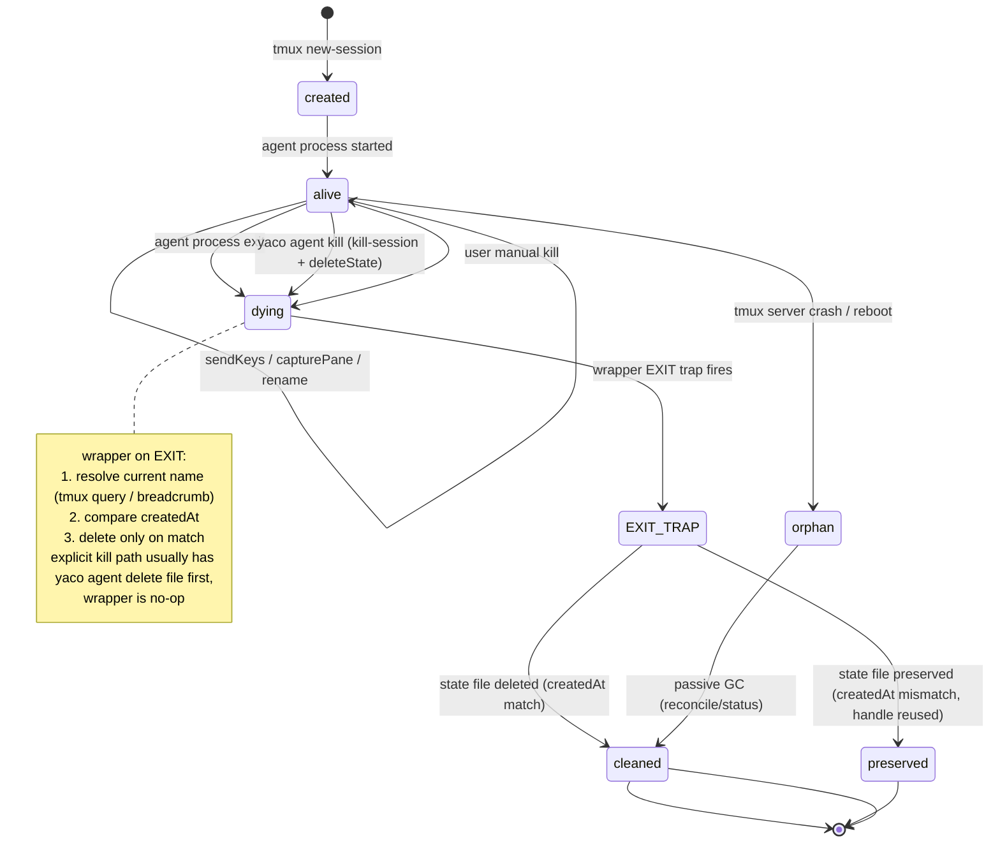
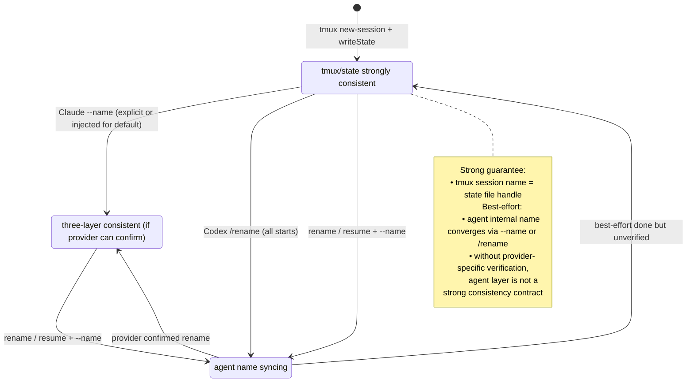
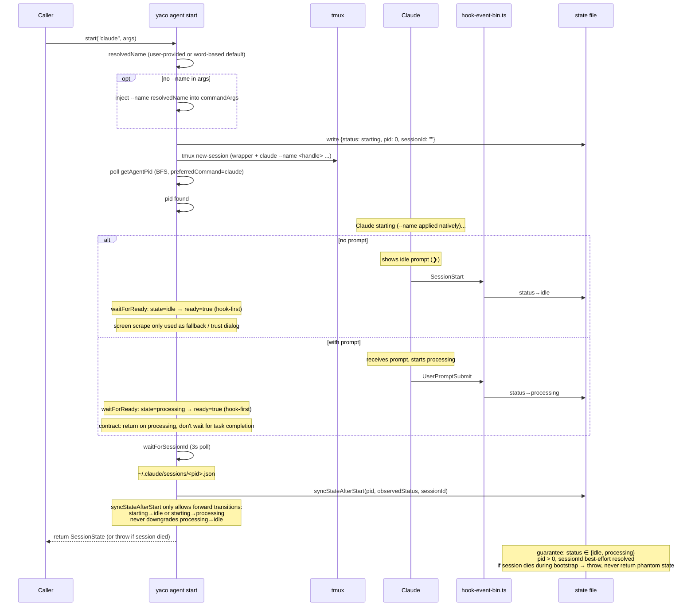
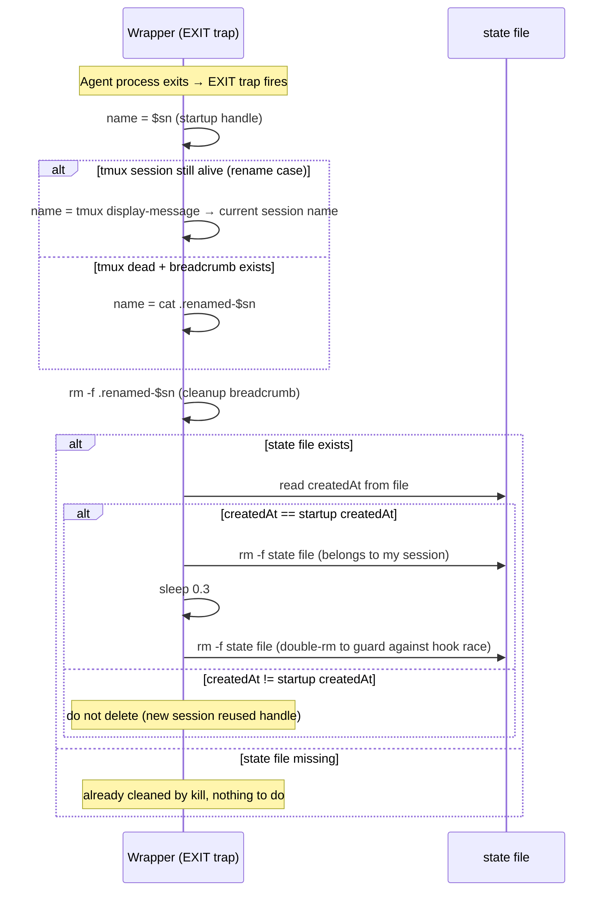

# Lifecycle

> Last updated: 2026-06-09 (Startup trust gating: Codex hooks-review interstitials are gated by the fail-closed `codexHooksAllYacoOwned` predicate → `blocked(trust)` on a foreign/unverifiable hook set. Prior: Codex async title sync — start enqueues `/rename` after ready and never waits for settle)

Visual state diagrams and sequence flows for session lifecycle. For the text-based state machine summary, see [architecture.md](architecture.md#state-machine). For provider-specific hooks and assumptions, see [providers.md](providers.md).

## State Diagram A: State File Status

Core state machine governing `${YACO_HOME:-~/.yaco}/sessions/<handle>.json`.


## State Diagram B: Tmux Session Lifecycle



## State Diagram C: Name Sync

Strong guarantee: tmux session name = state file handle. Agent internal name is best-effort (Claude: verifiable via session file; Codex: pane capture only).



## Sequence Diagram 1: Claude Start Flow

Claude x with/without prompt x with/without `--name`.



## Sequence Diagram 2: Codex Start Flow

All Codex starts (with or without `--name`) sync the provider title with `/rename`. P6 confirmed: Codex accepts `/rename` during processing, so YACO gates only on whether the input prompt is empty.

```mermaid
sequenceDiagram
    participant M as yaco agent start
    participant T as tmux
    participant X as Codex
    participant S as state file

    M->>M: resolvedName (user-provided or word-based default)
    M->>M: stripNameFlag(args) → cleanArgs
    Note over M: only strip --name, everything else passthrough

    M->>S: write {status: starting}
    M->>T: tmux new-session
    M->>T: startOscColorQueryResponder (when adapter terminal.respondToColorQuery)
    M->>M: poll getAgentPid
    M->>S: write pid

    alt with prompt (passthrough)
        Note over X: Codex receives prompt, starts processing
    else no prompt
        Note over X: Codex shows › prompt
    end

    Note over M: waitForReady: idle or processing both accepted<br/>Codex "Hooks need review" → trust-gated (see Startup Trust Gating):<br/>guard pass → auto-dismiss; guard fail → blocked(trust), bail early, no /rename
    M->>T: sendKeysWhenInputEmpty("/rename <handle>")
    Note over M: title sync is best-effort async<br/>no settle wait before start returns

    M->>M: sessionId = hook-written value or pending sentinel
    M->>S: syncStateAfterStart
    Note over M: can return during processing phase on bootstrap success; later hooks/status backfill sessionId
```

## Startup Trust Gating (Codex hooks review)

`waitForReady` auto-answers provider `startupInterstitials` by sending their
declared keys. Codex's two **hooks-review** screens (`Hooks need review … Trust
all and continue` and the `Press t to trust all` overlay) are gated behind a
fail-closed predicate `codexHooksAllYacoOwned(sessionPath)` (`lifecycle.ts`),
attached to the interstitial as `guard` + `blockReason: "trust"`
(`providers/codex.ts`). The guard runs **after** the interstitial's
`skipWhenPattern` skip, so only a genuinely-current dialog is gated.

- **guard passes** → YACO accounts for the entire effective hook set as its own
  → auto-press the keys; the session boots to `idle` as before.
- **guard fails** → `handleStartupInterstitial` writes `setStatus(state,
  "blocked", "trust")`, sends **no keys**, marks the interstitial handled, and
  `waitForReady` **bails early** (returns `false` — its hook-first check only
  returns ready for `idle`/`processing`, so without the bail a `blocked(trust)`
  session would spin to the 30s timeout). `start` returns without `/rename`; the
  `starting`-only guard in `syncStateAfterStart` leaves `blocked(trust)` intact.
  The user attaches, reviews, presses the key themselves, and Codex's
  `SessionStart` hook clears `blocked(trust)` → `idle` (the widened SessionStart
  guard — see [state-contract.md](state-contract.md)).

The **trust-FOLDER** interstitial (`trust this folder / Yes, I trust`) is a
separate per-path mechanism with no foreign-content notion and stays
**unguarded** (pure auto-Enter).

### `codexHooksAllYacoOwned` — fail-closed security predicate

Returns `true` only when it can positively verify the whole effective hook set
is YACO's own; on **any** uncertainty it returns `false` (block). It enumerates
**all four** effective Codex hook sources and ANDs them:

- global + project `hooks.json` (`~/.codex/hooks.json`,
  `<sessionPath>/.codex/hooks.json`, JSON), and inline `[hooks]` tables in global
  + project `config.toml` (parsed with `Bun.TOML.parse` — a malformed file throws
  → block).

Across every source it requires, in order:

1. **Event-key allowlist** — every map key must be in `CODEX_HOOK_EVENTS` (a hook
   under an event YACO never installs is foreign). config.toml additionally
   allows the reserved `state` key, **validated** as Codex's trusted-hash
   bookkeeping (`[hooks.state]`: a record map with no `command`/`hooks` structure
   anywhere) — never blindly skipped, so a handler smuggled under `state` blocks.
2. **Per-source shape** — hooks.json events are `Event: group[]` (array of
   groups); config.toml inline events are the object form `{ hooks: handler[] }`
   (from `[[hooks.<Event>.hooks]]`). A value in the wrong shape → block.
3. **Strict per-handler ownership** — every enabled handler must be
   `type: "command"` whose command is the **exact canonical** invocation
   `<yaco-binary> agent hook-event <Event>` (whole-string anchored, not a
   substring — unlike the `isYacoOwnedGroup` migration helper, so a mixed group
   with one foreign command blocks).

Returns `false` on any foreign handler, unknown event key, wrong per-source
shape, non-command type, unparseable/unreadable source, or unexpected shape.
`bypass_hook_trust` is out of scope (YACO never sets it); plugin-bundled hooks
are not modeled (YACO never installs them) → the conservative default blocks.

-> Tests: `test/trust-gate.test.ts` (registered in `package.json` `test:unit`).

## Sequence Diagram 3: Resume Flow

Claude/Codex x by sessionId or name.

```mermaid
sequenceDiagram
    participant U as Caller
    participant M as yaco agent start
    participant T as tmux
    participant A as Agent
    participant S as state file

    U->>M: start(provider, ["--resume", id, "--name", handle])
    M->>M: extractResume → resumeId = id (flag or positional)

    alt Claude
        Note over M: canonicalize: claude --resume <id> --name <handle>
        Note over M: Claude natively supports --resume + --name [verified P1]
    else Codex
        Note over M: canonicalize: codex resume <id> (--name stripped)
        Note over M: if name requested, provider title sync queues like fresh Codex starts
    end

    M->>S: write {status: starting, sessionId: resumeId}
    M->>T: tmux new-session
    M->>M: poll getAgentPid
    M->>M: waitForReady

    opt Codex
        M->>T: sendKeysWhenInputEmpty("/rename <handle>")
        Note over M: best-effort async title sync; no settle wait
    end

    Note over M: skip waitForSessionId (sessionId already known)
    M->>S: syncStateAfterStart
    M-->>U: return SessionState (or throw if session died)
```

## Sequence Diagram 5: Wrapper EXIT + Handle Reuse Guard



**Wrapper environment (lineage capture).** Before launching the provider, the
wrapper also exports `YACO_AGENT_HANDLE="$sn"` (so a child `yaco agent start`
records `parentSession`) and `unset`s the one-shot `YACO_AGENT_SPAWNED_BY` web
marker so it cannot leak into long-lived child sessions. A child renamed-parent
handle stays valid because `start()` normalizes it through the `.renamed-*`
breadcrumb chain — which `renameState()` keeps chain-safe by re-pointing
incoming breadcrumbs to the new handle (a→b→c leaves both `.renamed-a` and
`.renamed-b` pointing at `c`). -> See: [state-contract.md](state-contract.md#session-lineage-spawnedby--parentsession)

-> See: [architecture.md](architecture.md#exit-trap-wrapper), [src/lib/core/agent/lifecycle.ts](../../../cli/src/lib/core/agent/lifecycle.ts), [scripts/agent-wrapper.sh](../../../cli/scripts/agent-wrapper.sh)
## Rename Link Integrity

Handles are stored in two places outside the renamed session's own state file:
child sessions' `parentSession` lineage and tasks' `agents` links. `yaco agent
rename` re-points both so a rename never orphans a reference.

The session-state/tmux rename (`renameState` + tmux rename) is
**authoritative** and is allowed while the agent is `processing`. Provider
in-TUI `/rename` is best-effort and input-empty gated: it sends immediately only
when the prompt is empty, otherwise a detached helper waits for the input to
clear. The two reference rewrites run **after** the authoritative rename and are
**best-effort**: a failure is collected as a warning, never aborting the session
rename.

- **Child lineage** — `rewriteChildParentSessions(old, new)` scans live state
  files and rewrites any `parentSession === old` to `new`. Idempotent.
- **Task links** — the task store is resolved from the renamed session's
  `sessionPath` via `resolveTasksPathForSessionPath()`, which walks upward to the
  nearest project root (first ancestor with `yaco.toml` or `plan/tasks`, so a
  worktree or subdirectory `sessionPath` still resolves), then honors
  `yaco.toml [paths].tasks`. `rewriteTaskAgentHandle(tasksPath, old, new)` rewrites
  matching `agents` entries under the tasks-file lock — order-preserving, deduped
  if `new` was already linked, patched per-source-file so unrelated tasks aren't
  re-normalized. Idempotent.

If no task store resolves, or either rewrite throws, the rename still succeeds
and the cause is returned in `data.warnings` (`--json`). No durable alias table
is added; `.renamed-*` breadcrumbs remain wrapper-cleanup / stale-env-handle
support only, not the link model.

-> See: [src/commands/agent/rename.ts](../../../cli/src/commands/agent/rename.ts), [src/lib/core/task/link.ts](../../../cli/src/lib/core/task/link.ts), [src/lib/core/task/store.ts](../../../cli/src/lib/core/task/store.ts), [task.md](task.md#agents-link-rewrite-on-rename)
