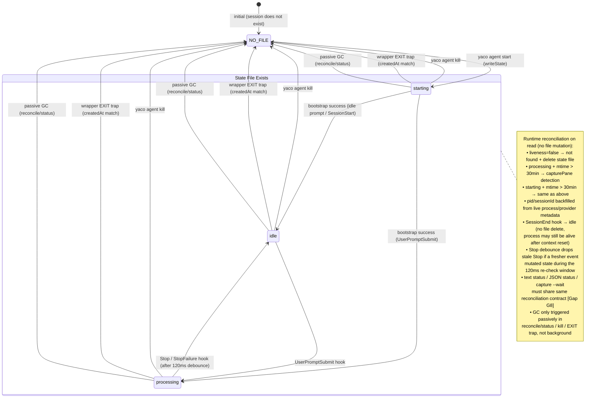
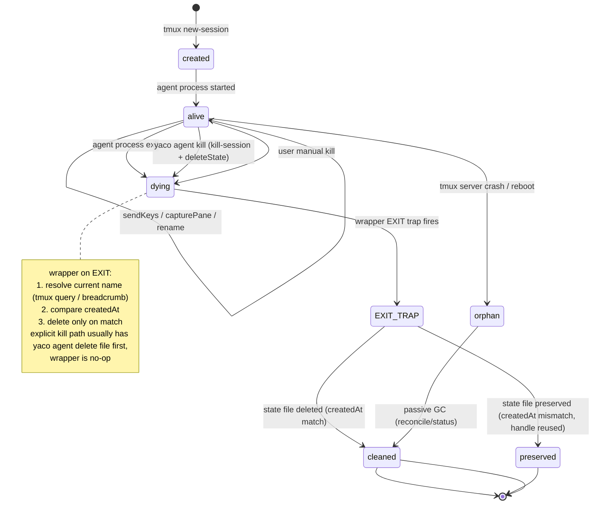
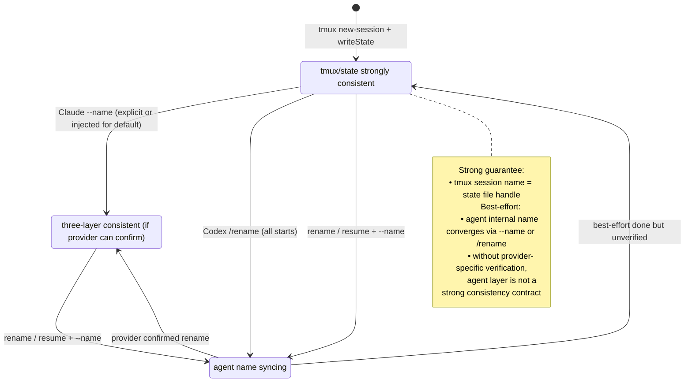
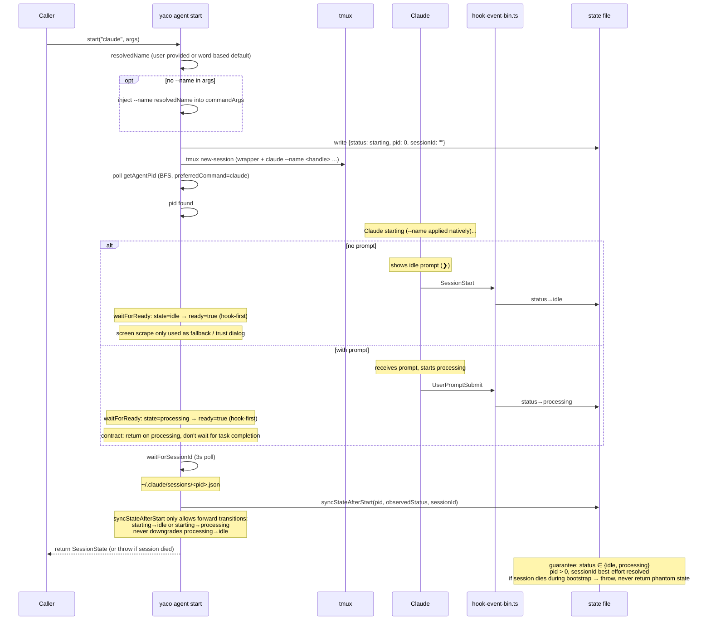
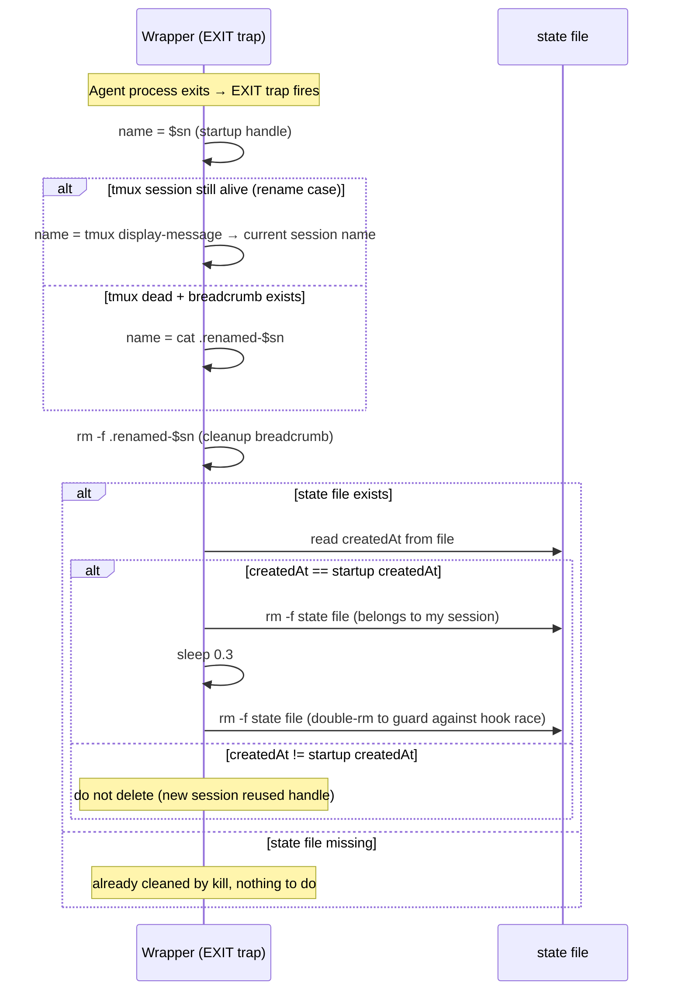

# Lifecycle

> Last updated: 2026-06-04 (yc-agent-subcommand: TS hook-event handler, agent-wrapper.sh, Stop debounce)

Visual state diagrams and sequence flows for session lifecycle. For the text-based state machine summary, see [architecture.md](architecture.md#state-machine). For provider-specific hooks and assumptions, see [providers.md](providers.md).

## State Diagram A: State File Status

Core state machine governing `${YACO_HOME:-~/.yaco}/sessions/<handle>.json`.



## State Diagram B: Tmux Session Lifecycle



## State Diagram C: Name Sync

Strong guarantee: tmux session name = state file handle. Agent internal name is best-effort (Claude: verifiable via session file; Codex: pane capture only).



## Sequence Diagram 1: Claude Start Flow

Claude x with/without prompt x with/without `--name`.



## Sequence Diagram 2: Codex Start Flow

All Codex starts (with or without `--name`) send `/rename` post-start. P6 confirmed: Codex accepts `/rename` during processing.

```mermaid
sequenceDiagram
    participant M as yaco agent start
    participant T as tmux
    participant X as Codex
    participant S as state file

    M->>M: resolvedName (user-provided or word-based default)
    M->>M: stripNameFlag(args) → cleanArgs
    Note over M: only strip --name, everything else passthrough

    M->>S: write {status: starting}
    M->>T: tmux new-session
    M->>M: poll getAgentPid
    M->>S: write pid

    alt with prompt (passthrough)
        Note over X: Codex receives prompt, starts processing
    else no prompt
        Note over X: Codex shows › prompt
    end

    Note over M: waitForReady: idle or processing both accepted<br/>auto-handles Codex "Hooks need review" trust prompt

    M->>T: sendKeys("/rename <handle>")
    Note over X: Best-effort title sync; start does not wait for completion

    M->>M: sessionId = hook-written value or pending sentinel
    M->>S: syncStateAfterStart
    Note over M: can return during processing phase on bootstrap success; later hooks/status backfill sessionId
```

## Sequence Diagram 3: Resume Flow

Claude/Codex x by sessionId or name.

```mermaid
sequenceDiagram
    participant U as Caller
    participant M as yaco agent start
    participant T as tmux
    participant A as Agent
    participant S as state file

    U->>M: start(provider, ["--resume", id, "--name", handle])
    M->>M: extractResume → resumeId = id (flag or positional)

    alt Claude
        Note over M: canonicalize: claude --resume <id> --name <handle>
        Note over M: Claude natively supports --resume + --name [verified P1]
    else Codex
        Note over M: canonicalize: codex resume <id> (--name stripped)
        Note over M: if name requested, still sends /rename <handle> after resume
    end

    M->>S: write {status: starting, sessionId: resumeId}
    M->>T: tmux new-session
    M->>M: poll getAgentPid
    M->>M: waitForReady

    opt Codex
        M->>T: sendKeys("/rename <handle>")
        Note over M: submit-only; no wait for provider title sync
    end

    Note over M: skip waitForSessionId (sessionId already known)
    M->>S: syncStateAfterStart
    M-->>U: return SessionState (or throw if session died)
```

## Sequence Diagram 5: Wrapper EXIT + Handle Reuse Guard



-> See: [architecture.md](architecture.md#exit-trap-wrapper), [src/lib/core/agent/lifecycle.ts](../../../cli/src/lib/core/agent/lifecycle.ts), [scripts/agent-wrapper.sh](../../../cli/scripts/agent-wrapper.sh)
