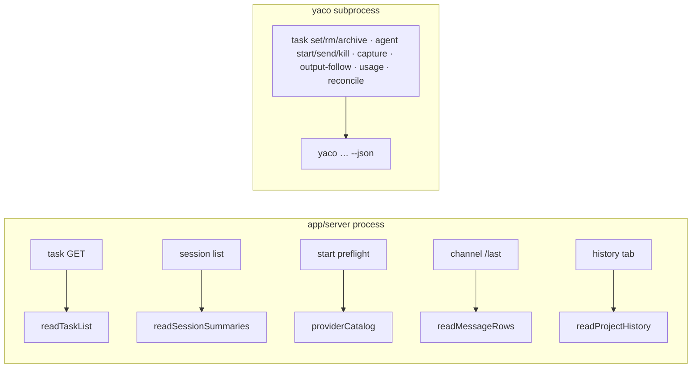

# The Read / Lifecycle Split

> Which app routes call the CLI inside the server's own process, which still
> spawn `yaco … --json`, what each move measured, and how to put any one of them
> back.

Last updated: 2026-08-11 (history-read-land — the fifth cutover, and the reader it needed) · Design: `plan/all/cli-node-sdk/final/design.md` (*Read-path adoption*, *Concurrency and event-loop safety*, *Staging and rollback*) · Parent: [README.md](README.md)

`app/server` used to reach every piece of CLI-owned data the same way: spawn the
`yaco` binary, wait for the child, parse its `--json` envelope. Five read paths
no longer do — they call the CLI's own function through
[`cli/package.json#exports`](exports.md), and the CLI command becomes an
argv-and-render adapter over that same function, so each read has one
implementation rather than two.

**Nothing that mutates, owns a lifecycle, or streams has moved, and none is
planned to.** The split is not "hot paths move" — it is a rule with three
independent conditions, each carrying its own evidence.

## The rule that admits a read in process

All three are asked of every candidate. They are separate questions, and the
first two are absolute — a path that fails either stays a subprocess. The third
is a measurement, and where a landed cutover falls short of it on one topology,
what shipped is the exception written down, not a softened condition.

1. **It is a read.** No lock, no repository gate, no write, no tmux, no process
   liveness, no detachment. Task mutation is one authority — lock, gate, write —
   and half of it inside the app process is how two writers end up disagreeing
   about who owns the file. Lifecycle is the same argument about tmux.

2. **Its closure is admissible.** Everything the export transitively imports
   runs inside the app's event loop under the app's lifetime, so what it may
   contain is a contract: explicit per-request state under a three-name ambient
   allowlist, no `process.exit` or stdout ownership, no polling loop and no
   synchronous process primitive (`execSync`, `spawnSync`, a synchronous sleep),
   asynchronous input-sized filesystem work, and one failure vocabulary. Bounded
   synchronous reads of a known file are allowed, and a `node:sqlite` query is
   admissible against a measured bound — rule 5 draws the line at *input-sized*
   work, not at the word "sync". `cli/test/unit/export-audit.test.ts` decides
   this over the TypeScript compiler's own import graph, per export, and a
   fourth ambient `process.env` name is a failing test rather than a review
   judgement. -> See: [exports.md](exports.md)

3. **It starves a queued request no longer than the route it replaces.** The
   design's condition, and the one that is measured rather than reasoned about.
   The instrument queues a timer, keeps re-queuing it for as long as the route
   runs, and takes the **worst** gap within one invocation; p95 is taken across
   invocations, with the two routes interleaved. The comparison is against the
   **complete** subprocess route — including the synchronous `ssh-add`
   environment discovery the parent pays before every spawn.

   **Two landed cutovers do not meet condition 3 everywhere, and were accepted
   with the exception written down rather than with the condition relaxed.**
   Cutover 1 reaches parity rather than improvement on a multi-megabyte
   single-file task store (29.15 → 31.63 ms p95; either route can win a run) and
   meets the condition by 3–7× on every other topology. Cutover 4 costs 14–23 ms
   against ~6 ms on the largest log in the local corpus, and is better or equal
   everywhere else. Both are stated below with what they cost and why the
   alternatives were rejected; neither gate was widened to admit its own result,
   and cutover 1's single-file case asserts only wall time, with the stall
   printed rather than bounded, because no threshold there separates a
   regression from the noise.

Condition 3 is the one that has produced surprises in both directions, so three
findings belong with the rule itself:

- **`spawn()` is not a free baseline.** A child that prints an empty envelope
  accounts for **33.2 of the subprocess history route's 32.3 ms** p95 — the two
  are the same number within run-to-run drift — and still costs 15.9 ms with
  `ssh-add` discovery removed: `fork` with a loaded heap. "Keep the subprocess"
  is not automatically the safe side of a starvation comparison.
- **A measuring instrument needs a control**, and the control has to be the
  *previous reader*. Both stall harnesses carry one — `summary-stall.ts` its
  `whole-file` route, `history-stall.ts` a checked-in copy of the reader it
  replaced — and each separates from its bounded successor by 5–11×. Without
  that separation, no figure either harness printed would have meant anything.
  **But a control is not free to run beside the thing it validates**: it grows
  the parent heap that every forked route then inherits, which moves the
  subprocess baseline and not the in-process one. Separation and bound come from
  different runs.
- **Bounding a scan and chunking it are different instruments for different
  problems, and only measurement tells them apart.** The history cutover does
  both, and its first control removed only the cap: that route *starved less*
  than what shipped, because a bigger scan yields more often. The chunked yield
  is what bounds the stall; the cap bounds wall time, and at ten times scale
  bounds both. A control on the wrong axis would have credited the cap with an
  improvement it does not produce. -> See: [below](#5--history-tab--readprojecthistory)

## What moved, and what it measured

Absolute milliseconds drift with machine load; the deltas are the evidence. The
artifacts holding each run are named below the table, and
[the dev workflow](../../dev/cli/workflow.md#re-running-the-read-path-measurements)
has the commands that reproduce them — except cutover 3's, which is a one-off
bound rather than a harness, and says so below.

| # | Path | Route wall (before → after) | p95 starvation of a queued request (before → after) |
|---:|---|---|---|
| 1 | `GET /api/tasks/:project` → `readTaskList` | **181.6 → 28.5 ms** median, 485 tasks, two live servers | **17.95 → 4.97 ms** (dir, 480) · **28.07 → 10.93 ms** (dir, 4 800) · **21.97 → 8.43 ms** (one file, 480) · **29.15 → 31.63 ms** (one file, 4 800 — parity, see below) |
| 2 | session-list labels → `readSessionSummaries` | **122 → 30 ms** p50 real provider home · **138 → 36 ms** synthetic 10× | **27.1 → 13.4 ms** · **34.3 → 14.1 ms** |
| 3 | `agent start` provider validation → `providerCatalog()` | **≥72.7 ms → <0.01 ms** (a CLI-only lower bound; see below) | no I/O and no environment read, so nothing to starve — and no failure mode |
| 4 | channel `/last` → `readMessageRows` | **357 → 3.8 ms** (240 KB log) · **656 → 30 ms** (6.1 MB) · **1 088 → 169 ms** (38 MB, real record shape) — 6.4×–94× | equal or better everywhere except the corpus extreme, where it costs **14–23 ms against ~6 ms** |
| 5 | history tab → `readProjectHistory` | **206 → 119 ms** p50 real provider home · **154 → 83 ms** synthetic 1× · **285 → 260 ms** synthetic 10× | **26.8 → 12.4 ms** · **29.7 → 13.7 ms** · **29.8 → 18.4 ms** |

Read alone, with HTTP framing out of it, a hand-run of cutover 1's comparison
over a copy of this repository's *actual* graph measured **153.9 → 10.7 ms** at
485 tasks and **427.3 → 72.1 ms** at 4 850. The committed harness falls back to
generated fixtures when `plan/tasks` is not in the checkout — which it is not in
a worktree, since `plan/` is a separate repository — and says which source it
used.

**Cutover 3's row is the one figure this milestone did not record at the time,
and it is a bound rather than a route measurement.** The task's artifacts prove
the spawn is *gone* — a stubbed `yaco` binary serves a whole session list and
never sees an `agent providers` call — but no route median was captured, because
the payload is three string fields fixed at build time and the property worth
proving was the absence of I/O, not a speedup.

So the row is measured for this document rather than quoted, and it is honest
about being a **lower bound on the before, and a ceiling on the after**:
21 samples of `node cli/bin/yaco.mjs agent providers --json` after a warm-up
gave a median of 72.7 ms (min 54.5 ms; an independent reproduction, 73.3 ms),
and that times the child alone — the app's retired path also paid
`buildChildProcessEnv()`'s synchronous `ssh-add` probe on every spawn, so the
real before was larger. The in-process call measures in the single-digit
microseconds, which is below what a wall clock resolves reliably: repeated runs
land anywhere from 0.0003 to 0.003 ms, so `<0.01 ms` is the claim the
measurement supports. The reproduction is in
[the dev workflow](../../dev/cli/workflow.md#re-running-the-read-path-measurements).

Parity evidence beside the timings: 45 frozen pre-cutover envelopes for the task
read; **611/611** identical labels on a real provider home for the summary read;
a fixture that runs the retired `1+n`-subprocess algorithm against the real
built binary and deep-equals its rows *and* its failure bodies for the message
read; and an unchanged CLI golden matrix throughout, so every command's stdout,
stderr and exit code are byte-identical to the pre-cutover build.

-> Artifacts: `plan/all/cli-node-sdk/qa-{task,message,summary}-read-cutover.md`
and the matching `impl-*-summary.md`.

### The limits that are on the record

None of these is a bug to be fixed later; each is a measured cost that was
accepted with its reason.

- **A multi-megabyte single-file task store reaches parity, not improvement.**
  One file is one `JSON.parse` of the whole graph — 28–65 ms for 7.5 MB — and no
  chunking divides it, while the subprocess route's parent parses the same data
  from the CLI's *compact* envelope and so does strictly less work. Both
  workarounds were rejected deliberately: a size threshold puts a magic constant
  and a topology decision in `app/server`, and incremental parsing needs a
  dependency the CLI does not carry. **Every other topology, including a single
  file at this repository's actual scale, meets the condition by 3–7×.**
  -> See: [task.md](task.md#reading)
- **One 38 MB message log costs 14–23 ms against the subprocess route's ~6 ms.**
  Traced, not waved at: one 1.36 MB record through the provider parser is 2 ms of
  indivisible work, and allocating the 40 MB read buffer accounts for up to
  8.9 ms. Subdividing a record means changing the provider parser. The gap is
  what reproduces, not the millisecond: re-running the bench on a loaded machine
  measured 31 ms against 8 ms while the wall time stayed 7× better on the same
  fixture.
- **The summary read skips a record over 4 MiB undecoded**, and searches the
  whole Codex `YYYY/MM/DD` rollout tree rather than eight days. Two independent
  changes in opposite directions — neither is "strictly more labels", and the
  611-session corpus instantiates neither. -> See:
  [providers.md](providers.md#session-summaries)
- **`RULE_5_DEBT` is empty.** The gate shipped owing exactly one synchronous
  traversal, cutover 1 discharged it, and the empty list stays as the shape of
  the check: a new synchronous traversal in an exported closure fails the audit.
  -> See: [exports.md](exports.md#the-tracked-debt-and-how-it-was-paid)
- **The history read is capped, not cheap.** Its cap is `limit + 1` rows per
  provider, so a project with more sessions than the window pays a two-phase
  Claude read — `stat` and a tail for *every* log — before the window is chosen.
  What the cap bounds is the expensive half: the head reads and the Codex rollout
  tails, 867 down to 201 on the reference home. Nothing bounds the number of logs
  a project's directories hold, and since the read covers the project's whole
  subtree that is now every worktree it has ever had, live or deleted.
  -> See: [above](#a-project-is-a-subtree)

## What still spawns

| Path | Why |
|---|---|
| `yaco agent messages` (`/messages`) | Reduced from `1+n` children to one. What it returns is the command's own **text rendering**, which lives in the command layer and is not export-eligible; moving it means lifting the renderers into `core` |
| `agent start`, `send`, `kill`, `capture`, `output-cursor`/`output-follow` | Mutation, lifecycle, tmux, detachment, streaming |
| `agent list --reconcile`, resume preflight | Synchronous tmux and process liveness |
| `agent usage` | A synchronous keychain closure, child and network lifecycle, cache writes, crash containment |
| every `yaco task` mutation | One authority: lock, repository gate, write |

The app also still reads **YACO-owned** state files (`${YACO_HOME}/sessions`,
`projects.json`) directly, and always did. Those are YACO-owned snapshots, not
provider storage, and the direct session-display reader is already in-process and
asynchronous — the design keeps it, and any future shared reader for it would be
a de-duplication case, not a latency one.

### 5 · history tab → `readProjectHistory`

The history read was the first `node:sqlite` query put to rule 5, and the answer
was not about the database: the `threads` query is **3.0 ms** at the p50, and
what failed the bound was the unbounded per-provider fan-out around it — every
row a provider holds read before the window is applied. The reader that ships
caps each provider at the window and reads in chunked instalments, and the
harness measures it against the one it replaced:

| Route (real provider home: 11.2 MB `state_5.sqlite`, 2 322 Codex threads, 115 Claude logs across 37 directories) | p95 starvation | wall p50 |
|---|---:|---:|
| a child that prints an empty envelope — the spawn alone | 28.8 ms | 76 ms |
| subprocess — the retired route | 28.2 ms | 272 ms |
| **the shipped reader called in process** | **23.1 ms** | **182 ms** |

Those are the figures after the read was widened from one cwd to the project's
whole subtree (below); the cutover measured 12.4 ms against 26.8 ms on 81 logs
and one directory. **The bound is the comparison, not the millisecond**, and the
comparison is what the widening had to preserve: two runs of the same three
routes on the same home put in-process at 18.1 ms against 30.5 and at 23.1
against 28.2, so the margin moves with the machine while the ordering does not.
It is re-run on the real home whenever the scan's shape changes.

**Which run a figure comes from is part of the figure**, and getting that wrong
was worth ~80 ms here. A forked route inherits the parent process's native
high-water mark and an in-process route pays no fork at all, so running the
heavy controls beside the spawns inflates the *subprocess* side of
`in-process <= subprocess` and barely moves the other — on the 10× fixture,
`subprocess` p95 measured 91.7 ms with the controls interleaved and 29.8 ms
without, while `in-process` moved 31.7 → 18.4 ms. So the bound is taken from
`--routes spawn-noop,subprocess,in-process`, and the harness prints
`NOT THE GATE` on any run that included a control.

The control is `cli/test/bench/history-retired-control.ts`, the previous module
checked in verbatim, and its job is separation rather than a bound: run beside
the shipped reader it is **over** the bound on all three fixtures (64.5 · 66.7 ·
345.1 ms) where the shipped reader is within (11.4 · 13.9 · 31.7 ms). That
separation is what makes the table above mean anything. Since the subtree
widening it is no longer like-for-like — the control still reads the single
directory it was written against while the shipped reader reads the project's
whole subtree — so it now reads as a *lower* bound on the gap.

Two decisions the benchmark could not answer:

- **The per-provider cap is `limit + 1`, and `--since` needs no plumbing.** The
  merge sorts by `updatedAt` and `--since` filters on the same `updatedAt`, so
  the rows past any cutoff are a *prefix* of each provider's newest-first order:
  a provider's newest `limit + 1` rows already are its window past every cutoff.
  `+ 1` rather than `limit` because `truncated` is `matching.length > limit`,
  which a cap of exactly `limit` would report as a full, untruncated window.
  A test deep-equals the capped read against an uncapped one at nine cutoffs and
  ten limits.
- **A provider's cap key must be the key the merge sorts by**, which is what
  retired the prototype's Claude cap on `stat` mtime: a Claude row's `updatedAt`
  is the index's `modified`, else the log's *own* last timestamp. Claude is read
  in two phases instead — tail-read every log for the ordering key, head-read
  only the window. Codex's `LIMIT` is exact because its ORDER BY column is the
  one `epochToISO` turns into `updatedAt`.

Everything the prototype dropped is restored and in the measurement above: the
`sessions-index.json` enrichment, the Claude first-user-message summary, the
Codex thread-name index, sidechain filtering and live tagging. Three parsers
were made to scan backward and stop at the first hit, which is why the restored
work is affordable — the last match found scanning backward is the last match,
so a 64 KB tail costs a `JSON.parse` rather than a scan.

#### A project is a subtree

A session belongs to a project when its cwd is the project path **or a
descendant of it**. That is not a new rule — it is the one the live session list
has always applied (`listByPath`'s prefix match, `resolveProjectForPath` /
`isPathDescendantOrEqual`). History keyed on an exact cwd instead, so an agent
working in `<project>/.worktrees/<slug>` — every `/orchestrate` worker and
reviewer — was listed while it ran and vanished the moment it was only history.
The two halves of one question answered with two scoping rules; history was the
odd one out.

Each provider widens in the terms its own storage offers:

| | how the subtree is found | what it costs on the reference home |
|---|---|---|
| Claude | one directory per cwd, so candidates are found by encoded-name prefix in `~/.claude/projects` and every log is then **attributed by the `cwd` it records** | 1 → 37 directories, 76 → 115 tail reads, plus one `readdir` of the root |
| Codex | the predicate goes into SQL, as `substr(cwd, 1, length(?)) = ?` against the literal `<cwd>/` | 588 → 867 rows matched, 3.0 → 8.6–9.1 ms p50 |

Three things the widening had to get right:

- **The name decides nothing; it only narrows what has to be read.**
  `encodeClaudeCwd` maps every non-alphanumeric to `-` and has no inverse, so
  the sibling project `<project>-backups` shares the prefix with
  `<project>/.worktrees/x` — and two distinct cwds can collide onto *one*
  directory, which is why attribution is per log and never per directory: one
  log deciding for its neighbours would admit and drop history according to
  `readdir` order. Nor can the filesystem answer: a worktree's directory is
  deleted when it merges, long before its history stops mattering — which is the
  very history this scan exists to find. The cwd comes out of the tail slice the
  log is read for anyway, so exact attribution costs no extra read.
  A log that records no cwd in those bytes belongs to **nothing** — there is no
  directory to fall back to, because the project's own encoded name is the same
  lossy encoding as any other and `/repo:demo` files into `/repo/demo`'s
  directory. What has to fit in the slice is the *field*, not the record around
  it: the cwd is matched in the raw bytes, taking the last match, because Claude
  writes `cwd` after `message` and a single record can be larger than the whole
  slice. On the reference home the furthest a last `cwd` sits from the end of a
  file is 20 KB against a 64 KB window, and byte-matching agrees with a
  whole-file parse on all 1 053 logs.
- **A path is a subtree of itself and of nothing shorter.** The prefix every
  descendant starts with is the project path plus exactly one separator; the
  filesystem root already carries its own, and a second would match no absolute
  path at all. Both providers derive it the same way, and `/` is a path
  `addProject` accepts.
- **The cap is taken once, over the union**, and the scan stays one fan-out at
  `READ_CONCURRENCY` however many directories a project spans. A per-directory
  cap would let one busy worktree crowd the project's own sessions out, and the
  window would stop being a prefix of the merged newest-first order — the
  property the whole cap argument rests on. The union also makes one row
  reachable twice, since a thread resumed under a second cwd is logged under
  both, so the tails are deduplicated newest-first with the path breaking a tie.

The subtree is matched **literally**, not as a pattern: `%` and `_` are legal in
a path and are wildcards in SQL `LIKE`, which also folds ASCII case where a POSIX
path does not.

-> See: [exports.md](exports.md#the-queries-rule-5-has-judged) for the judged
query and its bound, and
[the dev workflow](../../dev/cli/workflow.md#re-running-the-read-path-measurements)
for the commands.

## Rolling one back

The design's Phase-2 acceptance requires each cutover to be independently
reversible: putting one back restores the still-supported Node CLI subprocess
without disturbing the others. The durable form of that is *restore the app's
call site*, one route at a time:

| Cutover | Restore | Feature commit(s) |
|---|---|---|
| 1 · task GET | `runYacoTask(['list','--workset','all'], …)` in `app/server/src/routes/tasks.ts#buildTasksResponse`. `runYacoTask` is still there for the mutations, and nothing else in the app depends on `readTaskList` | route only; the CLI-side asynchronous store is a separate commit (`32d1736b`) and **stays** — that is what the design's *ordered* rollback means: Phase 2's route reverts without Phase 1's library |
| 2 · session summaries | the `yaco agent summaries --path 
 --json` spawn in `app/server/src/lib/session-summary.ts`. The cache in front of it is app-owned and unchanged | `3a773dab` |
| 3 · provider catalog | the `yaco agent providers --json` spawn in `app/server/src/lib/agent.ts` before `startAgentSession` | `5bbc6f0a` |
| 4 · channel `/last` | `agent.ts#lastAssistantMessages` and the router's import of it | `2709fcec` (app half); the CLI half `97ade32a` stays |
| 5 · history | `fetchHistory` in `app/server/src/lib/agent.ts` — a `runYacoAgentJson(['agent','history','--path',p,'--json'], YACO_AGENT_STATUS_TIMEOUT_MS, 'agent history')` returning `data.rows` — and `getHistory` calling it instead of `readProjectHistory`. This is the one restore that has to be *written back* rather than re-pointed: the helper was deleted with the cutover, because a dead second reader of the same data is what the cutover exists to remove | `4370553b` (the cutover), `66a27fc7` (review responses; it also fixes an unrelated defect in `runYacoAgentJson` that any rewrite of the helper should keep) |

**`git revert <sha>` is not the procedure, and the record should not be read as
one.** Each task tested its revert at the commit it had just made, and each
passed there — for cutover 4, `app/server`'s suite at 825 tests. A later commit
that adds lines to a file the revert deletes turns that same revert into a
modify/delete conflict, and one landed in both cases almost immediately.
Replayed:

| Revert | Clean at | Conflicts at |
|---|---|---|
| `2709fcec` | `2709fcec` | its own child `b0c959fd` onward — that task's final head, and today's — 2 paths |
| `3a773dab` + `5bbc6f0a` | `3a773dab` | the next commit `3c6ee4cd` onward, and today's head — 6 paths |
| `5bbc6f0a` alone | everywhere, including today's head | — |

So use the **Restore** column, which is durable, and treat a commit revert as a
convenience that has to be checked against the head you are on. The property the
design actually guarantees survives either way: **every CLI command these routes
used to spawn is unchanged and still shipped** — `yaco task list`,
`yaco agent summaries`, `yaco agent providers` and `yaco agent messages` render
exactly what they rendered before, which the unchanged golden matrix pins. That
is what makes the subprocess a live rollback target rather than a historical one.

## -> See

- [exports.md](exports.md) — the six eligibility rules, the closure audit, and the two rule-5 judgements
- [task.md](task.md#reading) — cutover 1's contract and its own measurements
- [providers.md](providers.md#session-summaries) — cutovers 2 and 4's contracts, and the accepted answer changes
- [architecture.md](architecture.md#cli--app-boundary) — the surfaces `app/server` consumes, and which of them still spawn
- [../app/backend/libs.md](../app/backend/libs.md) — the app-side call sites
