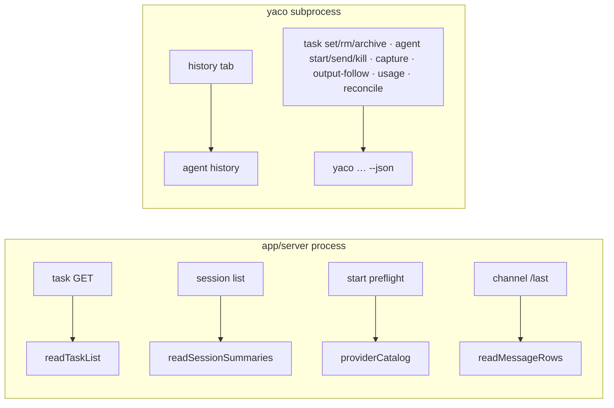

# The Read / Lifecycle Split

> Which app routes call the CLI inside the server's own process, which still
> spawn `yaco … --json`, what each move measured, and how to put any one of them
> back.

Last updated: 2026-08-11 (read-sdk-docs — the milestone record of the four landed cutovers) · Design: `plan/all/cli-node-sdk/final/design.md` (*Read-path adoption*, *Concurrency and event-loop safety*, *Staging and rollback*) · Parent: [README.md](README.md)

`app/server` used to reach every piece of CLI-owned data the same way: spawn the
`yaco` binary, wait for the child, parse its `--json` envelope. Four read paths
no longer do — they call the CLI's own function through
[`cli/package.json#exports`](exports.md), and the CLI command becomes an
argv-and-render adapter over that same function, so each read has one
implementation rather than two.

**Nothing that mutates, owns a lifecycle, or streams has moved, and none is
planned to.** The split is not "hot paths move" — it is a rule with three
independent conditions, each carrying its own evidence.

## The rule that admits a read in process

All three must hold. They are separate questions, and a path that satisfies two
of them stays a subprocess.

1. **It is a read.** No lock, no repository gate, no write, no tmux, no process
   liveness, no detachment. Task mutation is one authority — lock, gate, write —
   and half of it inside the app process is how two writers end up disagreeing
   about who owns the file. Lifecycle is the same argument about tmux.

2. **Its closure is admissible.** Everything the export transitively imports
   runs inside the app's event loop under the app's lifetime, so what it may
   contain is a contract: explicit per-request state under a three-name ambient
   allowlist, no `process.exit` or stdout ownership, no polling loop or
   synchronous primitive, asynchronous input-sized filesystem work, and one
   failure vocabulary. `cli/test/unit/export-audit.test.ts` decides this over
   the TypeScript compiler's own import graph, per export, and a fourth ambient
   `process.env` name is a failing test rather than a review judgement.
   -> See: [exports.md](exports.md)

3. **It starves a queued request no longer than the route it replaces.** The
   design's condition, and the one that is measured rather than reasoned about.
   The instrument queues a timer, keeps re-queuing it for as long as the route
   runs, and takes the **worst** gap within one invocation; p95 is taken across
   invocations, with the two routes interleaved. The comparison is against the
   **complete** subprocess route — including the synchronous `ssh-add`
   environment discovery the parent pays before every spawn.

Condition 3 is the one that has produced surprises in both directions, so two
findings belong with the rule itself:

- **`spawn()` is not a free baseline.** A child that prints an empty envelope
  accounts for **37.6 of the subprocess history route's 42.3 ms** p95, and still
  costs 15.9 ms with `ssh-add` discovery removed — `fork` with a loaded heap.
  "Keep the subprocess" is not automatically the safe side of a starvation
  comparison.
- **A measuring instrument needs a control.** `summary-stall.ts` carries a
  `whole-file` route — the previous reader's shape through the same call
  mechanism — and separates it from the bounded one by 10–50× at every scale.
  Without that separation, no figure the harness printed about the in-process
  route would have meant anything.

## What moved, and what it measured

Absolute milliseconds drift with machine load; the deltas are the evidence. The
artifacts holding each run are named below the table, and
[the dev workflow](../../dev/cli/workflow.md#re-running-the-read-path-measurements)
has the commands that reproduce them.

| # | Path | Route wall (before → after) | p95 starvation of a queued request (before → after) |
|---:|---|---|---|
| 1 | `GET /api/tasks/:project` → `readTaskList` | **181.6 → 28.5 ms** median, 485 tasks, two live servers | **17.95 → 4.97 ms** (dir, 480) · **28.07 → 10.93 ms** (dir, 4 800) · **21.97 → 8.43 ms** (one file, 480) · **29.15 → 31.63 ms** (one file, 4 800 — parity, see below) |
| 2 | session-list labels → `readSessionSummaries` | **122 → 30 ms** p50 real provider home · **138 → 36 ms** synthetic 10× | **27.1 → 13.4 ms** · **34.3 → 14.1 ms** |
| 3 | `agent start` provider validation → `providerCatalog()` | one spawn per start → none | a frozen array: no I/O, no environment read, no failure mode |
| 4 | channel `/last` → `readMessageRows` | **357 → 3.8 ms** (240 KB log) · **656 → 30 ms** (6.1 MB) · **1 088 → 169 ms** (38 MB, real record shape) — 7×–94× | equal or better everywhere except the corpus extreme, where it costs **14–23 ms against ~6 ms** |

Read alone, with HTTP framing out of it, a hand-run of cutover 1's comparison
over a copy of this repository's *actual* graph measured **153.9 → 10.7 ms** at
485 tasks and **427.3 → 72.1 ms** at 4 850. The committed harness falls back to
generated fixtures when `plan/tasks` is not in the checkout — which it is not in
a worktree, since `plan/` is a separate repository — and says which source it
used.

Parity evidence beside the timings: 45 frozen pre-cutover envelopes for the task
read; **611/611** identical labels on a real provider home for the summary read;
a fixture that runs the retired `1+n`-subprocess algorithm against the real
built binary and deep-equals its rows *and* its failure bodies for the message
read; and an unchanged CLI golden matrix throughout, so every command's stdout,
stderr and exit code are byte-identical to the pre-cutover build.

-> Artifacts: `plan/all/cli-node-sdk/qa-{task,message,summary}-read-cutover.md`
and the matching `impl-*-summary.md`.

### The limits that are on the record

None of these is a bug to be fixed later; each is a measured cost that was
accepted with its reason.

- **A multi-megabyte single-file task store reaches parity, not improvement.**
  One file is one `JSON.parse` of the whole graph — 28–65 ms for 7.5 MB — and no
  chunking divides it, while the subprocess route's parent parses the same data
  from the CLI's *compact* envelope and so does strictly less work. Both
  workarounds were rejected deliberately: a size threshold puts a magic constant
  and a topology decision in `app/server`, and incremental parsing needs a
  dependency the CLI does not carry. **Every other topology, including a single
  file at this repository's actual scale, meets the condition by 3–7×.**
  -> See: [task.md](task.md#reading)
- **One 38 MB message log costs 14–23 ms against the subprocess route's ~6 ms.**
  Traced, not waved at: one 1.36 MB record through the provider parser is 2 ms of
  indivisible work, and allocating the 40 MB read buffer accounts for up to
  8.9 ms. Subdividing a record means changing the provider parser. The gap is
  what reproduces, not the millisecond: re-running the bench on a loaded machine
  measured 31 ms against 8 ms while the wall time stayed 7× better on the same
  fixture.
- **The summary read skips a record over 4 MiB undecoded**, and searches the
  whole Codex `YYYY/MM/DD` rollout tree rather than eight days. Two independent
  changes in opposite directions — neither is "strictly more labels", and the
  611-session corpus instantiates neither. -> See:
  [providers.md](providers.md#session-summaries)
- **`RULE_5_DEBT` is empty.** The gate shipped owing exactly one synchronous
  traversal, cutover 1 discharged it, and the empty list stays as the shape of
  the check: a new synchronous traversal in an exported closure fails the audit.
  -> See: [exports.md](exports.md#the-tracked-debt-and-how-it-was-paid)

## What still spawns

| Path | Why |
|---|---|
| **history tab** (`yaco agent history`) | **Measured and left as a subprocess** — see below |
| `yaco agent messages` (`/messages`) | Reduced from `1+n` children to one. What it returns is the command's own **text rendering**, which lives in the command layer and is not export-eligible; moving it means lifting the renderers into `core` |
| `agent start`, `send`, `kill`, `capture`, `output-cursor`/`output-follow` | Mutation, lifecycle, tmux, detachment, streaming |
| `agent list --reconcile`, resume preflight | Synchronous tmux and process liveness |
| `agent usage` | A synchronous keychain closure, child and network lifecycle, cache writes, crash containment |
| every `yaco task` mutation | One authority: lock, repository gate, write |

The app also still reads **YACO-owned** state files (`${YACO_HOME}/sessions`,
`projects.json`) directly, and always did. Those are YACO-owned snapshots, not
provider storage, and the direct session-display reader is already in-process and
asynchronous — the design keeps it, and any future shared reader for it would be
a de-duplication case, not a latency one.

### The history read: measured, admitted, and still a subprocess

The history read was the first `node:sqlite` query put to rule 5, and the answer
was not about the database.

| Route (real provider home: 11.6 MB `state_5.sqlite`, 2 275 Codex threads, 81 Claude logs) | p95 starvation | wall p50 |
|---|---:|---:|
| a child that prints an empty envelope — the spawn alone | 37.6 ms | 64 ms |
| subprocess — the route today | 42.3 ms | 344 ms |
| the shipped reader called in process | 79.2 ms | 142 ms |
| a bounded, chunked prototype of it | 12.8 ms | 103 ms |

- The `threads` query costs **4–9 ms**. What fails the bound is the unbounded
  per-provider fan-out around it — every row a provider holds is read before the
  window is applied, ~22 MB of parsing per request.
- A bounded, chunked reader clears the bound at **every** swept chunk size
  (1–16), 12–18 ms across the sweep. At chunk 8 its p95 worst starvation is
  **12.4–14.4 ms** across the three fixtures, against **42.3–119.8 ms** for the
  subprocess route on the same three — and it runs 3–12× faster.

So the path is admitted — **in that bounded form only**, and nothing was
exported. Landing it needs four files that task did not own (`core/agent`'s
barrel, an asynchronous `origin.ts` lookup, the audit pins, and the CLI adapter)
and two decisions the benchmark does not answer: `--since` filters *after* the
provider merge, so a cap has to be the window past the cutoff; and the prototype
drops the `sessions-index.json` enrichment, the Claude first-user-message
summary, the Codex thread-name index, sidechain filtering and live tagging, all
of which have to be restored before its numbers describe a shipped reader.

**The successor is `history-read-land`**, in the task graph.
-> See: [exports.md](exports.md#the-queries-rule-5-has-judged) for the harness
and its reproduction commands.

## Rolling one back

The design's Phase-2 acceptance requires each cutover to be independently
reversible: reverting one restores the still-supported Node CLI subprocess
without reverting the others. That property holds because **every CLI command
the app used to spawn is unchanged and still shipped** — `yaco task list`,
`yaco agent summaries`, `yaco agent providers` and `yaco agent messages` all
render exactly what they rendered before their route moved, which the unchanged
golden matrix pins.

The durable rollback is therefore *restore the app's call site*, one route at a
time:

| Cutover | Restore | Verified |
|---|---|---|
| 1 · task GET | `runYacoTask(['list','--workset','all'], …)` in `app/server/src/routes/tasks.ts#buildTasksResponse`. `runYacoTask` is still there for the mutations, and nothing else in the app depends on `readTaskList` | The CLI-side asynchronous store is a separate commit (`32d1736b`) and stays — that is what the design's *ordered* rollback means: Phase 2's route reverts without Phase 1's library |
| 2 · session summaries | the `yaco agent summaries --path 
 --json` spawn in `app/server/src/lib/session-summary.ts`. The cache in front of it is app-owned and unchanged | Both feature commits (`5bbc6f0a` catalog, `3a773dab` summaries) were reverted on a scratch branch at that task's head: applied cleanly, every suite green, CLI output byte-identical |
| 3 · provider catalog | the `yaco agent providers --json` spawn in `app/server/src/lib/agent.ts` before `startAgentSession` | same run as cutover 2 |
| 4 · channel `/last` | `agent.ts#lastAssistantMessages` and the router's import of it | **`git revert --no-commit 2709fcec`** on a throwaway branch at that task's head: `app/server`'s suite passed, 825 tests, with the CLI half (`97ade32a`) still in place |
| 5 · history | nothing — it never moved | |

**A recorded revert SHA is evidence, not a recipe.** Each was verified at its own
task's head. Replayed at the milestone head, cutovers 2 and 4 conflict, because
later cutovers edited the same files — reverting `2709fcec` now wants to delete
`channels/agent-messages.ts`, which `summary-read-cutover` has since modified.
Resolving that is ordinary work, but it is work: reach for the "restore" column,
and treat the SHA as the record of what was proven.

## -> See

- [exports.md](exports.md) — the six eligibility rules, the closure audit, and the two rule-5 judgements
- [task.md](task.md#reading) — cutover 1's contract and its own measurements
- [providers.md](providers.md#session-summaries) — cutovers 2 and 4's contracts, and the accepted answer changes
- [architecture.md](architecture.md#cli--app-boundary) — the surfaces `app/server` consumes, and which of them still spawn
- [../app/backend/libs.md](../app/backend/libs.md) — the app-side call sites
